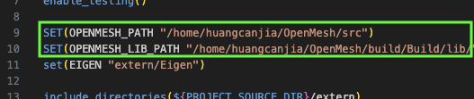

# 4-Rosy-Complex-Poly 项目配置记录

本文档为配置文章 **"Designing N-PolyVector Fields with Complex Polynomials"** 的基于 **OpenMesh** 的复现版本 [LucasGao2000/4-Rosy-Complex-Poly](https://github.com/LucasGao2000/4-Rosy-Complex-Poly) 的记录，原文章作者提供的代码的配置记录见 [nPV 项目配置记录](../nPV/)

---

Canjia Huang <<canjia7@gmail.com>> last update 26/3/2025

# :penguin: Ubuntu

- 操作系统：Ubuntu 20.04.5 LTS

## 配置步骤

1. 将项目下载到本地：

    ```
    git clone https://github.com/LucasGao2000/4-Rosy-Complex-Poly.git
    ```

    进入项目目录：

    ```
    cd 4-Rosy-Complex-Poly
    ```

2. 新建编译目录并进入：

    ```
    mkdir build
    cd build
    ```

3. 使用 CMake 进行 configure：

    ```
    cmake -DCMAKE_BUILD_TYPE=Release ..
    ```

4. 编译：

    ```
    make
    ```

    - :warning: 可能出现错误 `OpenMesh/Core/Mesh/Handles.hh: No such file or directory`

        这是因为作者在 “4-Rosy-Complex-Poly/CMakeLists.txt” 中是直接设置 **OpenMesh** 库所在目录，并不是通过查找库来设置的

        首先需要安装 **OpenMesh** 库，具体可以参考 [OpenMesh 库配置记录](../OpenMesh/)

        安装完成后，修改 “4-Rosy-Complex-Poly/CMakeLists.txt” 文件的 Line 9-10 为实际安装 **OpenMesh** 库的相应目录，如我这里修改绿框处（具体路径依据实际情况而定）：

        

        修改并保存后，重新使用 CMake 进行 configure 并编译

5. 编译完成后会在 “4-Rosy-Complex-Poly/build/” 目录下生成 “4-ROSY” 可执行文件

## 测试

1. 直接运行编译生成的可执行文件 “4-ROSY”：

    ```
    ./4-ROSY
    ```

2. 该可执行文件会直接将 “../data/woody.obj” 文件为参考网格，生成该网格的 4-RoSy field，存储在 “../data/cf.obj” 文件中，可以用 **MeshLab** 进行可视化