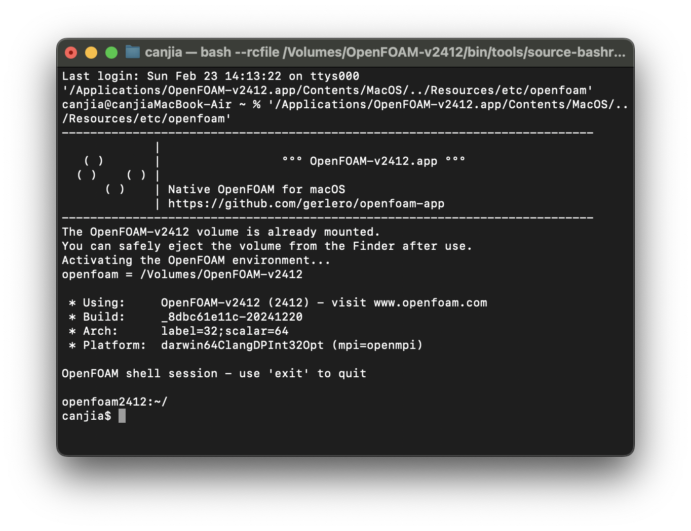
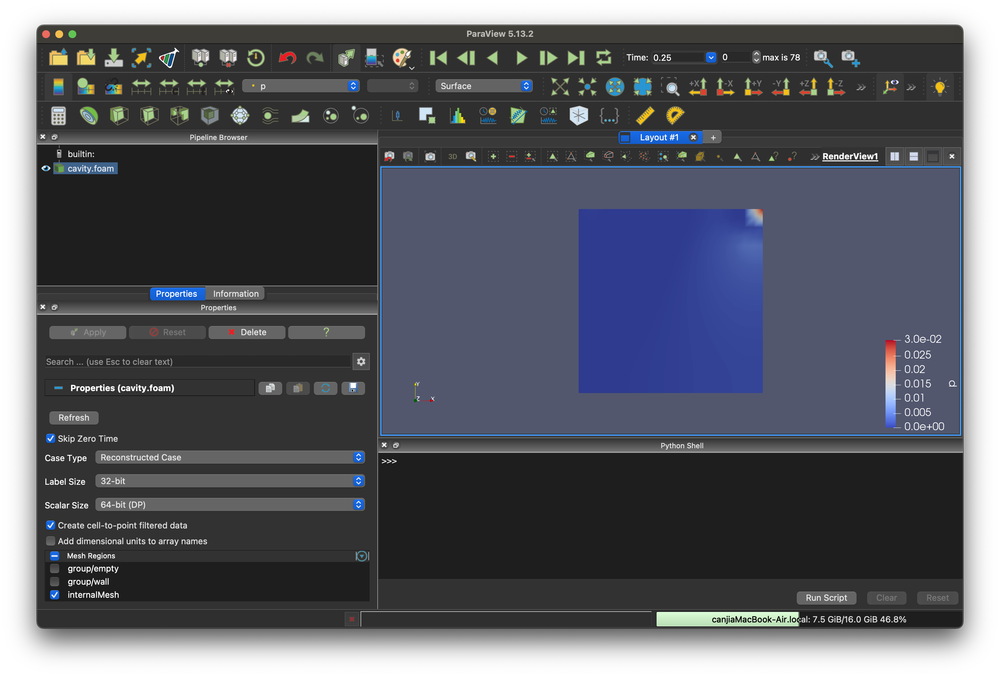

# OpenFOAM 配置记录与基础操作

# :apple: macOS

Canjia Huang <<canjia7@gmail.com>> last update 25/2/2025

- 操作平台：MacBook Air (Apple M3) - macOS 15.3
- OpenFOAM 版本：OpenFOAM-v2412

## :round_pushpin: 安装

这里安装的是 [openfoam-app](https://github.com/gerlero/openfoam-app) ，有2种安装方式：

### 1. 直接使用 homebrew 安装

:bangbang: 这种安装方式非常方便，但是安装后 **OpenFOAM** 库的位置是位于挂载磁盘中的，使用终端执行操作不受影响，但若要自己编译求解器等时就无法再编译并写入（通过改变挂载磁盘的读写权限可能可以解决）

根据 [openfoam-app](https://github.com/gerlero/openfoam-app) 的 [README](https://github.com/gerlero/openfoam-app/blob/main/README.md) 中的步骤进行安装即可：

1. 安装 **Homebrew**
2. 终端中输入：
    `brew install --no-quarantine gerlero/openfoam/openfoam`

安装完成后，在启动台中会多出一个应用程序 **OpenFOAM-v2412.app**（具体名称取决于安装版本，这里均以此版本为例）

### 2. 根据源码编译安装（ :+1: 推荐）

在 [openfoam-app](https://github.com/gerlero/openfoam-app) 的 [README Building from source](https://github.com/gerlero/openfoam-app/blob/main/README.md#-building-from-source) 中也有提到该安装方式：

1. 安装 [**pixi**](https://pixi.sh/latest/)，推荐用 **Homebrew** 安装（需先安装 **Homebrew**），在终端中输入：
   `brew install pixi`
   
   同时可能还需要安装 **Xcode Command Line Tools**，但我可能之前安装过所以并不需要
2. 将 **openfoam-app** 仓库git clone到本地，在终端输入：
    `git clone https://github.com/gerlero/openfoam-app.git`
3. 进入 **openfoam-app** 目录并编译：
   `pixi run make`

完成编译后在 openfoam-app/build 中会多出一个应用程序 **OpenFOAM-v2412.app**（该应用与使用 **Homebrew** 安装类似，库的位置也挂载于磁盘）

同时在 openfoam-app/build 下会出现一个磁盘文件 **OpenFOAM-v2412-build.sparsebundle**，打开后会挂载库的磁盘（如果已经挂载着磁盘，需要先将挂载着的磁盘推出）， :floppy_disk: 此时挂载的磁盘是可编辑并写入的

   - 如果通过打开 **OpenFOAM-v2412-build.sparsebundle** 来挂载磁盘的情况下，可以通过打开挂载着的磁盘中的脚本 **openfoam** 来打开终端（该脚本的路径为：/Volumes/OpenFOAM-v2412/etc/**openfoam**）;或者将 **OpenFOAM** 相关的环境变量添加到系统变量后（相关操作见后文 *入门操作（wmake编译求解器）*），可以在终端中直接执行

如果只需要编译 **OpenFOAM-v2412-build.sparsebundle** 而不需要编译 **OpenFOAM-v2412.app**，可以将第3步中的编译命令改为执行：`pixi run make build`

### Paraview 安装（ :bulb: 可选）

OpenFOAM 可以通过 paraFoam 脚本来启动可视化软件 [paraview](https://www.paraview.org) 以可视化结果，同样可以使用 **Homebrew** 安装，根据 [brew/paraview](https://formulae.brew.sh/cask/paraview) 中步骤进行安装即可：

1. 安装 **Homebrew**
2. 终端中输入：
   `brew install --cask paraview`

## :round_pushpin: 入门操作（终端）

直接启动 **OpenFOAM-v2412.app**（或已经挂载磁盘的情况下启动磁盘中的脚本 etc/**openfoam**），会打开一个终端界面，可以在该终端界面中直接使用 OpenFOAM 的相关指令：



接下来可以通过具体案例测试一下，可以参考[官网相关文档-Examples](https://doc.openfoam.com/2312/examples/)

打开 **OpenFOAM-v2412.app** 后会挂载一个磁盘 **OpenFOAM-v2412**，该磁盘中 tutorials 目录下存放有一些测试案例

这里测试 /Volumes/OpenFOAM-v2412/tutorials/incompressible/pisoFoam/RAS/cavity 下的例子

 - OpenFOAM是将<u>要进行求解的问题</u>以及<u>求解器的参数</u>都存储在文件夹中的各个文件中，具体可以参考[官网相关文档-Quickstart](https://doc.openfoam.com/2312/quickstart/)，这里简要列出该案例的文件结构：
    ```
    cavity
        - 0.orig/ （包含在0时刻的初始/边界条件）
        - constant/ （包含定义着模拟中使用到的几何和物理性质的常数）
        - system/ （包含求解器参数和模拟工具等的设置）
        - Allclean （脚本）
        - Allrun （脚本）
        - Allrun-parallel （脚本）
    ```

:bangbang: 需要注意的是，如果你是通过打开 **OpenFOAM-v2412.app** 来开启终端的，此时挂载的磁盘没有读写权限，这会导致执行求解操作后生成的结果文件无法存储（可能可以通过改变磁盘的权限来解决），所以可以先将该案例文件夹复制到本地路径，我进行复制后的测试案例文件夹路径为：/Users/canjia/CFD/cavity

由于该案例已经包含 **Allrun** 脚本，可以通过执行该脚本来完成整个案例的测试（一般自己的案例可能要手动分几个步骤来完成，或自己编写 **Allrun** 脚本）

在 **OpenFOAM-v2412.app** 打开的终端中输入：

```
cd /Users/canjia/CFD/cavity
./Allrun
```

成功执行后会在 /Users/canjia/CFD/cavity 目录下生成许多求解结果相关的文件

如果已经安装了 **paraview**，可以对结果进行可视化，此时继续在 **OpenFOAM-v2412.app** 打开的终端中输入：

```
paraFoam
```

会自动打开 **Paraview**，可视化结果如下：



可以点击 **Paraview** 窗口上方的播放键来可视化模拟过程

## :round_pushpin: 入门操作（wmake编译求解器）

**wmake** 是 **OpenFOAM** 中使用的构建工具，专门用于编译和链接 **OpenFOAM** 的源代码及其相关的应用程序和库，可以用于编译自定义求解器

为使用 **wmake**，首先需要将 **OpenFOAM** 相关的环境变量添加进系统变量

使用 bash shell（或直接在上述过程中打开的 **OpenFOAM** 终端中），source 挂载磁盘中的 etc/**bashrc** 文件（具体路径根据实际情况确定）：

```
cd /Volumes/OpenFOAM-v2412/etc
source bashrc
```

执行后可以在终端中输入 `echo $WM_PROJECT_DIR` 来检查是否成功载入了环境变量

为了在后续操作中也能载入该环境变量，可以将环境变量写入 ~/**.bashrc** 或 ～/**.zshrc** 文件中

以本平台为例，打开 ～/**.zshrc** 文件（该文件为隐藏文件，可以通过终端打开或在 **Finder** 中使用快捷键 `command + shift + .` 来开启/关闭显示隐藏文件），在文件的最后添加上（具体路径根据实际情况确定）：

```
. /Volumes/OpenFOAM-v2412/etc/bashrc
```

并在终端中重新载入系统环境变量：

```
source ~/.zshrc
```

同样可以通过 `echo` 来输出变量以检查环境变量是否成功载入

:sweat: 需要注意的是，这样操作的本质是在载入系统环境变量时载入 . /Volumes/OpenFOAM-v2412/etc/**bashrc**，但如果你在没挂载 **OpenFOAM** 磁盘的情况下，是无法使用 source 载入环境变量的

   - 这意味着在重新启动电脑后，你需要重新挂载上磁盘并重新执行一次 `source ~/.zshrc` 指令（或许可以尝试将挂载磁盘中的环境变量文件放置在本地其他目录...）
   - 另外如果在后续操作中始终无法配好环境变量的话，不妨重启试试...

:star: 接下来通过一个例子来使用 **wmake** 编译求解器，并使用该求解器求解案例，该案例源自 [BasicOpenFOAMProgrammingTutorials](https://github.com/UnnamedMoose/BasicOpenFOAMProgrammingTutorials/tree/master) 的 **OFtutorial13_waveEquationSolver**，但该案例使用的 **OpenFOAM** 版本较老，使用 **wmake** 编译求解器时会出错，所以我将该案例修正以适合本文档使用的 **OpenFOAM** 版本，并将其放置在本文档目录中 [OFtutorial13_waveEquationSolver](OFtutorial13_waveEquationSolver)

:bangbang: 需要注意的是，在进行编译的时候需要始终保持 **OpenFOAM** 磁盘挂载着的状态，否则会找不到相关路径

### 步骤 1：下载案例

将本文档目录下的 [OFtutorial13_waveEquationSolver](OFtutorial13_waveEquationSolver) 保存至本地目录，这里示例的目录为：/Users/canjia/CFD/OFtutorial13_waveEquationSolver，并在终端中进入该目录：

```
cd /Users/canjia/CFD/OFtutorial13_waveEquationSolver
```

### 步骤 2：wmake编译求解器

**wmake** 是通过使用该目录下的 **Make** 文件夹中的 **file** 和 **options** 文件来设置生成求解器的位置和选项

使用文本查看器打开 **files** 文件可以看到设置的求解器生成位置：`EXE = $(FOAM_USER_APPBIN)/ofTutorial13`，可以在终端中使用 `echo $FOAM_USER_APPBIN` 指令来查看具体的路径

接下来执行该目录下的 **Allwmake** 脚本（或直接执行 `wmake` 指令）：

```
./Allwmake
```

该脚本会在上述目录 `EXE = $(FOAM_USER_APPBIN)` 中生成求解器 **ofTutorial13** 脚本

可以对求解器 **ofTutorial13** 使用 `-help` 指令来获取帮助信息，在终端中输入：

```
$FOAM_USER_APPBIN/ofTutorial13 -help
```

### 步骤 3：OpenFOAM生成求解网格

接下来进入该案例中的 **testCase** 文件夹，并执行其中的 **Allrun** 脚本构建模拟用的网格：

```
cd /Users/canjia/CFD/OFtutorial13_waveEquationSolver/testCase
./Allrun
```

脚本运行完成后会在 **testCase** 文件夹中生成文件 **log.blockMesh** 和 **log.setFields**

此时可以使用 `paraFoam` 来打开 **Paraview** 以可视化该网格，但由于还没进行模拟，所以该网格并无法查看模拟动画

### 步骤 4：使用自编译求解器进行模拟

接下来使用步骤 2中编译的求解器对该问题进行模拟，在终端中输入

```
$FOAM_USER_APPBIN/ofTutorial13 -case /Users/canjia/CFD/OFtutorial13_waveEquationSolver/testCase
```

模拟过程会在 **testCase** 文件夹下生成结果相关的文件，可以使用 **Paraview** 对模拟过程进行可视化，在 **testCase** 文件夹下在终端中执行：

```
paraFoam
```

可视化界面如下：


首先在 **Paraview** 左上角调整可视化的数据，默认是 **Solid Color**，调整为需要可视化的变量，如 **h**，然后使用上方的播放键以播放模拟过程

## :round_pushpin: 入门操作（CMake）

可以使用 **CMake** 来构建可以使用 **OpenFOAM** 的 C++ 项目，以生成求解器

- IDE：CLion 2024.3.2

这里同样以本文档目录下的 [OFtutorial13_waveEquationSolver](OFtutorial13_waveEquationSolver) 案例为例

### 步骤 1：下载案例

将本文档目录下的 [OFtutorial13_waveEquationSolver](OFtutorial13_waveEquationSolver) 保存至本地目录，这里示例的目录为：/Users/canjia/CFD/

### 步骤 2：编写CMakeLists

在该案例目录的根目录下新建 **CMakeLists.txt**，并在其中写入（参考自[【OpenFOAM】用VS Code调试OpenFOAM](https://blog.csdn.net/weixin_43940314/article/details/123771467)）：

```
cmake_minimum_required(VERSION 3.21)

if (DEFINED ENV{WM_PROJECT})
    message("Using $ENV{WM_PROJECT}-$ENV{WM_PROJECT_VERSION}")
    set(WM_PATH, ${CMAKE_SOURCE_DIR})
else()
    message(FATAL_ERROR "OpenFOAM environment not set. Aborting.")
endif ()

project(OFtutorial13)

set(CMAKE_CXX_STANDARD 17)
set(CMAKE_CXX_STANDARD_REQUIRED ON)
set(CMAKE_CXX_EXTENSIONS OFF)
set(OpenFOAM_VERSION $ENV{WM_PROJECT_VERSION})
set(OpenFOAM_DIR $ENV{WM_PROJECT_DIR})
set(OpenFOAM_LIB_DIR $ENV{FOAM_LIBBIN})
set(OpenFOAM_SRC $ENV{FOAM_SRC})

set(DEFINITIONS_COMPILE *******)

add_definitions("${DEFINITIONS_COMPILE}")

include_directories(
        ${OpenFOAM_SRC}/finiteVolume/lnInclude
        ${OpenFOAM_SRC}/meshTools/lnInclude
        lnInclude
        .
        ${OpenFOAM_SRC}/OpenFOAM/lnInclude
        ${OpenFOAM_SRC}/OSspecific/POSIX/lnInclude
)

link_directories(${OpenFOAM_LIB_DIR} ${OpenFOAM_LIB_DIR}/dummy ${OpenFOAM_LIB_DIR}/${PATH_LIB_OPENMPI})

add_executable(${PROJECT_NAME} ofTutorial13.C)

target_link_libraries(${PROJECT_NAME} OpenFOAM dl m Pstream finiteVolume fvOptions meshTools )
```

:bangbang: 这里需要注意的是第20行 `set(DEFINITIONS_COMPILE *******)` 这里的星号待输入，下一步会提到

### 步骤 3：获取 DEFINITIONS_COMPILE

如在 **wmake** 的例子中一样，在终端中进入案例所在目录，并执行`wmake`：

```
cd /Users/canjia/CFD/OFtutorial13_waveEquationSolver
./Allwmake
```

执行后会使用 **wmake** 对案例求解器进行编译，这个编译的结果并不重要，目的仅是为了根据终端的输出结果来确定 **DEFINITIONS_COMPILE** 的值

执行上述指令后在终端中会输出（具体内容可能根据平台不同会有差异）：

```
Making dependencies: ofTutorial13.C
clang++ -std=c++17 -m64 -pthread -ftrapping-math -ffp-contract=off -DOPENFOAM=2412 -DWM_DP -DWM_LABEL_SIZE=32 -Wall -Wextra -Wold-style-cast -Wnon-virtual-dtor -Wno-unused-parameter -Wno-invalid-offsetof -Wno-undefined-var-template -Wno-unknown-warning-option -O3  -DNoRepository -ftemplate-depth-100 -I/Volumes/OpenFOAM-v2412/env/include  -I/Volumes/OpenFOAM-v2412/src/finiteVolume/lnInclude -I/Volumes/OpenFOAM-v2412/src/meshTools/lnInclude -iquote. -IlnInclude -I/Volumes/OpenFOAM-v2412/src/OpenFOAM/lnInclude -I/Volumes/OpenFOAM-v2412/src/OSspecific/POSIX/lnInclude   -fPIC -c ofTutorial13.C -o Make/darwin64ClangDPInt32Opt/ofTutorial13.o
clang++ -std=c++17 -m64 -pthread -ftrapping-math -ffp-contract=off -DOPENFOAM=2412 -DWM_DP -DWM_LABEL_SIZE=32 -Wall -Wextra -Wold-style-cast -Wnon-virtual-dtor -Wno-unused-parameter -Wno-invalid-offsetof -Wno-undefined-var-template -Wno-unknown-warning-option -O3  -DNoRepository -ftemplate-depth-100 -I/Volumes/OpenFOAM-v2412/env/include  -I/Volumes/OpenFOAM-v2412/src/finiteVolume/lnInclude -I/Volumes/OpenFOAM-v2412/src/meshTools/lnInclude -iquote. -IlnInclude -I/Volumes/OpenFOAM-v2412/src/OpenFOAM/lnInclude -I/Volumes/OpenFOAM-v2412/src/OSspecific/POSIX/lnInclude   -fPIC  -rpath @executable_path/../lib/openmpi -rpath @executable_path/../lib -rpath @executable_path/../lib/dummy -rpath @executable_path/../lib/../../../env/lib -Wl,-execute,-undefined,dynamic_lookup -L/Volumes/OpenFOAM-v2412/env/lib  Make/darwin64ClangDPInt32Opt/ofTutorial13.o -L/Volumes/OpenFOAM-v2412/platforms/darwin64ClangDPInt32Opt/lib \
	    -lfiniteVolume -lmeshTools -lOpenFOAM -ldl  \
	     -lm -o /Users/canjia/OpenFOAM/canjia-v2412/platforms/darwin64ClangDPInt32Opt/bin/ofTutorial13
```

这里输出的内容中的 `-std=c++17 -m64 -pthread -ftrapping-math -ffp-contract=off -DOPENFOAM=2412 -DWM_DP -DWM_LABEL_SIZE=32 -Wall -Wextra -Wold-style-cast -Wnon-virtual-dtor -Wno-unused-parameter -Wno-invalid-offsetof -Wno-undefined-var-template -Wno-unknown-warning-option -O3  -DNoRepository -ftemplate-depth-100 -I/Volumes/OpenFOAM-v2412/env/include  -I/Volumes/OpenFOAM-v2412/src/finiteVolume/lnInclude -I/Volumes/OpenFOAM-v2412/src/meshTools/lnInclude -iquote. -IlnInclude -I/Volumes/OpenFOAM-v2412/src/OpenFOAM/lnInclude -I/Volumes/OpenFOAM-v2412/src/OSspecific/POSIX/lnInclude   -fPIC` 就是 **DEFINITIONS_COMPILE** 应为的值

将该值替换到 **CMakeLists.txt** 中 `set(DEFINITIONS_COMPILE *******)` 的星号处

### 步骤 4：CMake生成并执行

接下来根据常用的 **CMake** 项目生成方式生成即可：

```
mkdir build
cd build
cmake ..
make
```

编译后就会在 build 目录下生成相应的求解器 **OFtutorial13**，后续测试案例的步骤同 :round_pushpin: **入门操作（wmake编译求解器）**（仅求解器目录有变化）

### Some Tips

- 如果使用 **CLion** IDE 的话，载入环境变量后需重启 IDE；另外如果出现无法解决的问题也可以尝试一下重启 IDE 或系统
- **OpenFOAM** 相关的头文件许多的后缀名是大写的字母： ".H"，写成小写的可能会找不到文件，具体名称可以到对应目录查找确认

# Some Resources

- [OpenFOAM 官网](https://www.openfoam.com)
- [OpenFOAM 官方api文档](https://api.openfoam.com/2306/)
- [OpenFOAM v12 User Guide](https://doc.cfd.direct/openfoam/user-guide-v12/index) - [Tutorials](https://doc.cfd.direct/openfoam/user-guide-v12/tutorials)
- [BasicOpenFOAMProgrammingTutorials](https://github.com/UnnamedMoose/BasicOpenFOAMProgrammingTutorials/tree/master) - Introduces basic C++ concepts to beginner users of the OpenFOAM open-source CFD libraries.
   - 该项目的例子使用的 **OpenFOAM** 版本过老，编译时可能会出现因版本更新导致的不兼容错误 
- [中文交流论坛（CFD中文网）](https://cfd-china.com/category/6/openfoam)
- [DYFLUID OpenFOAM 虚拟机/教程/算例/代码](http://www.dyfluid.com/solvers.html)