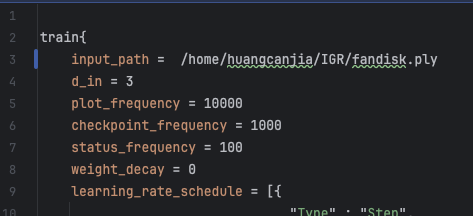
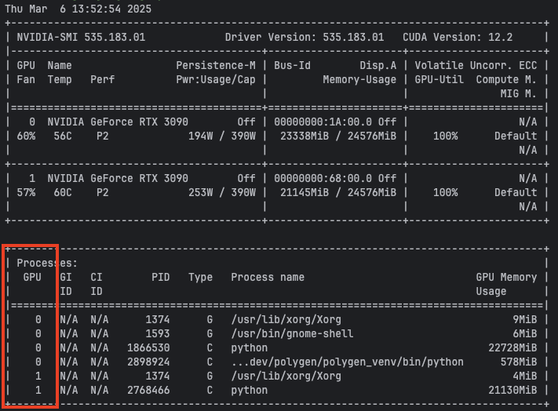
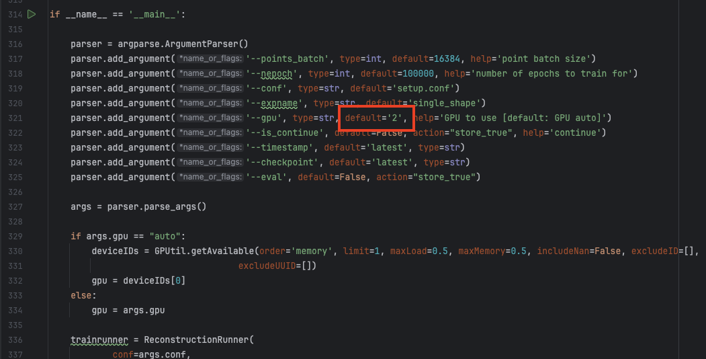

# IGR 配置记录

Canjia Huang <<canjia7@gmail.com>> last update 05/3/2025

本文档为配置 paper：“**Implicit Geometric Regualrization for Learning Shapes**” 的代码的记录 [[Paper]](https://dl.acm.org/doi/abs/10.5555/3524938.3525293) [[Code]](https://github.com/amosgropp/IGR)

```
@incollection{icml2020_2086,
 author = {Gropp, Amos and Yariv, Lior and Haim, Niv and Atzmon, Matan and Lipman, Yaron},
 booktitle = {Proceedings of Machine Learning and Systems 2020},
 pages = {3569--3579},
 title = {Implicit Geometric Regularization for Learning Shapes},
 year = {2020}
}
```

# :penguin: Ubuntu

- 操作系统：Ubuntu 20.04.6
- 显卡：NVIDIA GeForce RTX 3090
- CUDA Version：12.2

## 操作步骤

1. 将项目下载到本地：

    ```
    git clone https://github.com/amosgropp/IGR.git
    ```

    进入项目目录

    ```
    cd IGR
    ```

---

:star: 我把测试成功的环境进行了导出，存放在该文档目录下的 [environment.yml](environment.yml) 文件

如果想使用该环境文件，先将 [environment.yml](environment.yml) 文件下载到本地，然后执行：

```
conda env create -f environment.yml
```

成功创建后使用指令 `conda env list` 可以看到新创建了一个 `igr` conda 环境，使用 `conda activate igr` 激活该 conda 环境，配置至此完成

如果不想使用该环境文件，则继续以下步骤

---

2. 创建 Python 3.7 的 conda 环境：

    ```
    conda create -n igr python=3.7
    ```

    激活该环境：

    ```
    conda activate igr
    ```

3. 安装 pytorch（原作者使用的版本是 1.2，但该版本并没有适用于我的显卡以及 CUDA 版本的版本，所以具体版本应视实际设备而定）：

    ```
    conda install pytorch==1.13.1 torchvision==0.14.1 torchaudio==0.13.1 pytorch-cuda=11.7 -c pytorch -c nvidia
    ```

4. 安装其他依赖库

    - **numpy**

    ```
    conda install anaconda::numpy
    ```

    - **pyhocon**

    ```
    conda install conda-forge::pyhocon
    ```

    - **plotly**

    ```
    conda install plotly::plotly
    ```

    - **scikit-image**

    ```
    conda install anaconda::scikit-image
    ```

    - **trimesh**

    ```
    conda install conda-forge::trimesh
    ``` 

## 测试

### Surface reconstruction

这里使用的测试输入点云数据来自 [QiujieDong/NeurCADRecon](https://github.com/QiujieDong/NeurCADRecon)，我也将该点云文件放置在该文档目录下 [fandisk.ply](fandisk.ply)

首先将该点云数据下载到本地，这里我下载的路径为 "/home/huangcanjia/IGR/fandisk.ply"

1. 可能还有一些库需要安装，在激活的 conda 环境中输入：

    - **GPUtil**

    ```
    conda install conda-forge::gputil
    ```

2. 修改读入点云模型的路径，打开 "IGR/code/reconstruction/setup.conf" 文件，将其中 Line 3 的 `input_path = ***` 改为点云模型的路径，如我这里改为（具体路径视实际情况而定）：

    

3. 根据原项目中 [Usage/Surface reconstruction](https://github.com/amosgropp/IGR?tab=readme-ov-file#surface-reconstruction) 章节的步骤：

    ```
    cd ./code
    python reconstruction/run.py
    ```

    - :warning: 可能出现错误 `ModuleNotFoundError: No module named 'numpy.typing'`

        解决方法参考 [[1]](https://blog.csdn.net/wq6qeg88/article/details/137208140)，在激活的 conda 环境终端中输入：

        ```
        pip install -U numpy
        ```

    - :warning: 可能出现错误 `RuntimeError: cuda runtime error (38) : no CUDA-capable device is detected at ***`

        解决方法参考 [[2]](https://blog.csdn.net/qq_41115379/article/details/109996463)，在 “IGR/code/reconstruction/run.py” 文件中，设置了使用的 GPU 编号为 2（见下下图红框处），而使用指令 `nvidia-smi` 指令可以查询使用的 GPU 编号只有 0 和 1（见下图，以具体情况为准），所以需要进行修改

        

        将 “IGR/code/reconstruction/run.py” 文件中的下图红框处 `default='2'` 改为 `default='0'` 或 `default='1'`（具体编号依据实际情况为准）

        

    - :warning: 可能出现错误 `RuntimeError: CUDA error: CUBLAS_STATUS_EXECUTION_FAILED when calling cublasSgemm( handle, opa, opb, m, n, k, &alpha, a, lda, b, ldb, &beta, c, ldc)`

        可能是 pytorch 版本与 CUDA 版本不兼容导致的，可以尝试换几个 pytorch 版本

运行的过程中可以在目录 "IGR/exps/single_shape" 下找到当前时间节点的结果，有可视化文件 `html` 和模型文件 `ply`