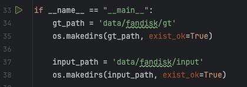

# NeurCADRecon 配置记录

Canjia Huang <<canjia7@gmail.com>> last update 04/3/2025

本文档为配置文章 “**NeurCADRecon: Neural Representation for Reconstructing CAD Surfaces by Enforcing Zero Gaussian Curvature**” 的代码的记录 [[Paper]](https://dl.acm.org/doi/10.1145/3658171) [[PDF]](https://arxiv.org/pdf/2404.13420) [[Project Page]](https://qiujiedong.github.io/publications/NeurCADRecon/) [[Code-SIREN]](https://github.com/QiujieDong/NeurCADRecon) [[Code-IGR]](https://github.com/QiujieDong/NeurCADRecon_IGR)

```
@article{10.1145/3658171,
    author = {Dong, Qiujie and Xu, Rui and Wang, Pengfei and Chen, Shuangmin and Xin, Shiqing and Jia, Xiaohong and Wang, Wenping and Tu, Changhe},
    title = {NeurCADRecon: Neural Representation for Reconstructing CAD Surfaces by Enforcing Zero Gaussian Curvature},
    year = {2024},
    issue_date = {July 2024},
    publisher = {Association for Computing Machinery},
    address = {New York, NY, USA},
    volume = {43},
    number = {4},
    issn = {0730-0301},
    url = {https://doi.org/10.1145/3658171},
    doi = {10.1145/3658171},
    abstract = {Despite recent advances in reconstructing an organic model with the neural signed distance function (SDF), the high-fidelity reconstruction of a CAD model directly from low-quality unoriented point clouds remains a significant challenge. In this paper, we address this challenge based on the prior observation that the surface of a CAD model is generally composed of piecewise surface patches, each approximately developable even around the feature line. Our approach, named NeurCADRecon, is self-supervised, and its loss includes a developability term to encourage the Gaussian curvature toward 0 while ensuring fidelity to the input points (see the teaser figure). Noticing that the Gaussian curvature is non-zero at tip points, we introduce a double-trough curve to tolerate the existence of these tip points. Furthermore, we develop a dynamic sampling strategy to deal with situations where the given points are incomplete or too sparse. Since our resulting neural SDFs can clearly manifest sharp feature points/lines, one can easily extract the feature-aligned triangle mesh from the SDF and then decompose it into smooth surface patches, greatly reducing the difficulty of recovering the parametric CAD design. A comprehensive comparison with existing state-of-the-art methods shows the significant advantage of our approach in reconstructing faithful CAD shapes.},
    journal = {ACM Trans. Graph.},
    month = jul,
    articleno = {51},
    numpages = {17},
    keywords = {CAD model, unoriented point cloud, surface reconstruction, signed distance function, gaussian curvature}
}
```

本文档配置的代码为基于 SIREN 的版本

# :penguin: Ubuntu

- 操作系统：Ubuntu 20.04.6

## 预备步骤

1. 安装 Anaconda
2. 安装 CUDA 环境（本文档使用的版本是 12.2）
3. :star: 直接导入配好的虚拟环境
   
   下载该目录下的 [environment.yml](environment.yml) 文件（created by [Xiaoyang Yu](https://github.com/Xiaoyanglib)），并在 conda 环境下的终端中执行：
   
   ```
   conda env create -f environment.yml
   ```

   执行后会根据该文件创建一个配置好的 conda 环境，可以使用 `conda env list` 命令来查看已有的环境，应该会多出一个 `neurcad` 的环境

   使用命令 `conda activate neurcad` 来激活该环境

## 测试项目

在激活上述环境的情况下，接下来根据 [NeurCADRecon-github](https://github.com/QiujieDong/NeurCADRecon) 中 [README](https://github.com/QiujieDong/NeurCADRecon/blob/main/README.md) 步骤执行即可

执行的过程可能会出现以下错误，解决步骤如下：

### Error 1: Preprocessing - 路径错误

执行 Preprocessing 时，`pre_processing/pre_data.py` 文件的 Line:34 和 Line: 37 中的路径为作者的本地路径，需要进行调整，可以调整为如下图：



### Error 2: 缺少 package

如果你是通过导入 [environment.yml](environment.yml) 文件来创建虚拟环境的话，应该不会遇到这个问题，首先需要检查当前激活的是否是 `neurcad` 环境

过程中出现错误 `ModuleNotFoundError: No module named ******`，是因为某些 package 没有安装，需要手动安装

项目中的文件所依赖的 package 大致如下（具体情况视实际情况而定）：

```
pre_data.py
├─── tqdm
├─── open3d
│      ├─── configargparse
│      └─── nbformat
├─── trimesh
├─── tensorboardX
├─── scipy
├─── skimage
├─── sklearn
├─── mcubes
├─── mayplotlib
├─── torchinfo
└─── trimesh

train_surface_reconstruction.py
```

:warning: 每个需要安装的 package 可以在 [Anaconda.org](https://anaconda.org/anaconda) 上进行查找，并且可以看到每个 package 有不同的 sources，如果使用的 sources 不适合你的平台，会出现 `Solving environment: failed` 的错误，此时需要在 [Anaconda.org](https://anaconda.org/anaconda) 重新找到合适的 sources

:warning: 如果你的操作系统是 macOS 的话，一些 sources 可能仅适用于 osx-64 架构，而你可能需要使用架构为 osx-arm64 的，具体情况因你的设备而定


安装完成后可以通过命令 `pip check` 来检查依赖库的安装情况