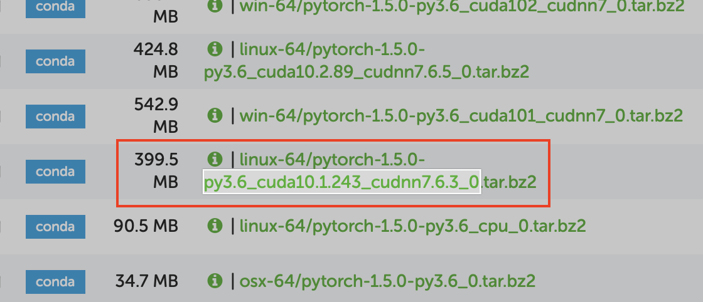
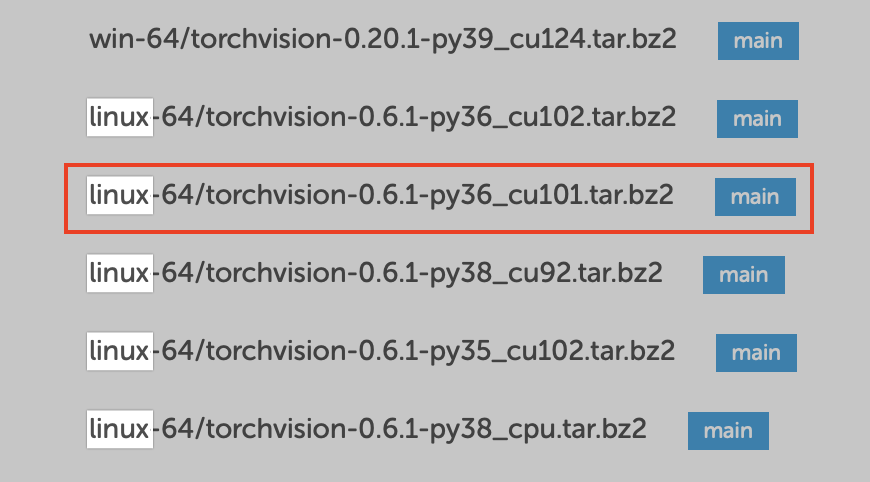
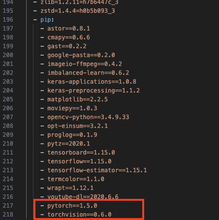

# siren 配置记录

Canjia Huang <<canjia7@gmail.com>> last update 17/3/2025

本文档为配置 paper：“**Implicit Neural Representations with Periodic Activation Functions**” 的代码的记录 [[Paper]](https://proceedings.neurips.cc/paper/2020/hash/53c04118df112c13a8c34b38343b9c10-Abstract.html) [[Project Page]](https://www.vincentsitzmann.com/siren/) [[Code]](https://github.com/vsitzmann/siren)

```
@inproceedings{sitzmann2019siren,
    author = {Sitzmann, Vincent
              and Martel, Julien N.P.
              and Bergman, Alexander W.
              and Lindell, David B.
              and Wetzstein, Gordon},
    title = {Implicit Neural Representations
              with Periodic Activation Functions},
    booktitle = {arXiv},
    year={2020}
}
```

# :penguin: Ubuntu

- 操作系统：Ubuntu 20.04.6
- 显卡：NVIDIA GeForce RTX 3090
- CUDA Version：12.2

## 操作步骤

---

:star: 我把测试成功的环境进行了导出，存放在该文档目录下的 [environment_siren.yml](environment_siren.yml) 文件

如果想使用该环境文件，先将 [environment_siren.yml](environment_siren.yml) 文件下载到本地，然后执行：

```
conda env create -f environment_siren.yml
```

成功创建后使用指令 `conda env list` 可以看到新创建了一个 `siren` conda 环境，使用 `conda activate siren` 激活该 conda 环境，配置至此完成

如果不想使用该环境文件，想根据原作者文档操作，则继续以下步骤

---

1. 将项目下载到本地：

    ```
    git clone https://github.com/vsitzmann/siren.git
    ```

    进入项目目录

    ```
    cd siren
    ```

2. 根据该项目所提供的 "siren/environment.yml" 文件创建 conda 环境：

    ```
    conda env create -f environment.yml
    ```

    - :warning: 可能会出现 `ResolvePackageNotFound` 的问题，我这里出现的问题为：

        ```
        ResolvePackageNotFound:
            - pytorch==1.5.0=py3.6_cuda10.1.243_cudnn7.6.3_0
            - torchvision==0.6.0=py36_cu101
        ```

        解决方法参考 [[1]](https://zhuanlan.zhihu.com/p/686083298)，可能是这两个库的版本在该环境文件中的 channels 中找不到，我的解决过程如下：

        作者提供的环境配置文件中包含了 build 的信息，我手动将其去除了，并注释掉了 `dependencies:` 中的 `pytorch==1.5.0=py3.6_cuda10.1.243_cudnn7.6.3_0` 项

        处理后的 [environment.yml](NeurField/SIREN-Ubuntu20.04.6/environment.yml) 文件位于该文档目录下，可自行进行替换

<!--
        - 对于 **pytorch==1.5.0=py3.6_cuda10.1.243_cudnn7.6.3_0**

            可以在 [zeus1942/packages/pytorch](https://anaconda.org/zeus1942/pytorch/files?__cf_chl_jschl_tk__=5ca17dc80cbdc72360d7e4a054585c27ad54d92d-1608304229-0-AeZf7AHGA69FSaQMM-ZRFx5C7W5GldNJbaviKSMZgBmZfDMTKSzYKm2OhlVPvmCQvanZecawsPn6KnAFs0KBu6fI7rE8XBBFSP_CiYQd-tj8oGrPgCbY5vdwy1KAW6J54700SF5aNYx59OQ3exUJaqSobokjjIS1hWFZ851NRin4weHj-vEjmcSiFaFFgX74aBZ1C1TmxZ26ZLYc-BVu1X8yzi5Z4hdcTB40WKj2yr58HAgITtoRTpm6hwehsIAh-aN1YhJN-SLMoaQzG02ISzERX-ksUXumvSyH_JcuGmsxqHv9Aw4RygYI8YcRxWKSwh_WxbU2JvTrkcozJOTstIWeatf2z3FG1VU7GNhEeBST0BOF1JIr3-BbxsBR1B02F3uz20Uie-xOk-VZu0tZa30) 中找到 pytorch==1.5.0=py3.6_cuda10.1.243_cudnn7.6.3_0（见下图）

            ，所以可以在 "siren/environment.yml" 文件中的 `channels:` 中添加一项 `zeus1942`
        
        - 对于 **torchvision==0.6.0=py36_cu101**

            在 https://anaconda.org/pytorch/repo/files 可以找到 torchvision 在已有的 channel 中并没有 0.6.0 的版本，只有 0.6.1 的版本（如下图），所以可以将 "siren/environment.yml" 文件中的 `torchvision==0.6.0=py36_cu101` 改为 `torchvision==0.6.1=py36_cu101`

            


        解决方法参考 [[1]](https://blog.csdn.net/qq_42537872/article/details/129365531)，将出错的 package 从 "siren/environment.yml" 中的 `dependencies:` 中删除（如下图），并在之后手动安装

        

        

    安装完成后，激活该 conda 环境：

    ```
    conda activate siren
    ```

    然后补充安装之前从 "siren/environment.yml" 中删除的 package，如我这里需要补充安装 pytorch 和 torchvision（具体视情况而定）：

    ```
    conda install pytorch==1.10.0 torchvision==0.11.0 torchaudio==0.10.0 cudatoolkit=11.3 -c pytorch -c conda-forge
    ```


        
        并将它们添加到 `pip:` 中
        
        package 名称的格式可能需要修改，因为 `pip` 识别版本时的标识符是 `==` 而不是 `dependencies:` 中写的 `=`，所以需要修改。如原有的 environment.yml 中的 `dependencies:` 中的是 `torchvision=0.6.0=py36_cu101`，添加到 `pip:` 中的是 `torchvision==0.6.0`

        

        修改后重新创建 conda 环境

        - :warning: 可能还是会出现错误 `Pip subprocess error` 导致一些 package 没有安装上，此时可以先进入已经创建好的环境 `siren`，然后手动使用 `pip` 指令来安装剩余的 package

            如我这里是手动执行了 `pip install torchvision==0.6.0`
-->
3. 激活 conda 环境：

    ```
    conda activate siren
    ```

## 测试

### Image experiments

1. 参考 [vsitzmann/siren/README.md-Image experiments](https://github.com/vsitzmann/siren?tab=readme-ov-file#image-experiments) 中执行（原指令中缺乏 `--experiment_name` 参数，需要自行设置，如下）：

    ```
    python experiment_scripts/train_img.py --model_type=sine --experiment_name=output
    ```

    - :warning: 出现错误 `ImportError: TensorBoard logging requires TensorBoard with Python summary writer installed. This should be available in 1.14 or above.`

        解决方法参考 [[1]](https://blog.csdn.net/qq_36854776/article/details/118405177)，输入：

        ```
        pip install tensorboard==1.14.0
        ```

        安装完成后重新执行 python 程序

    - :warning: 可能需要额外安装 `opencv`，在该 conda 环境激活的情况下执行：

        ```
        pip install opencv-python==3.4.9.33
        ```

        - :warning: 由于该 conda 环境是 python3.6 的，所以直接使用 `pip install opencv-python` 安装会出现许多错误，如 `ERROR: Could not build wheels for opencv-python which use PEP 517 and cannot be installed directly`，`ERROR: Could not build wheels for opencv-python, which is required to install pyproject.toml-based projects` 等

            可以参考 [[1]](https://blog.csdn.net/weixin_45091564/article/details/136258948)，在 [Links for opencv-python](https://pypi.tuna.tsinghua.edu.cn/simple/opencv-python/) 中查找适合的 opencv 版本进行安装

    - :warning: 可能需要额外安装 `cmapy`，在该 conda 环境激活的情况下执行：

        ```
        conda install -c conda-forge cmapy 
        ```

2. 训练结果会存放在 “siren/logs/output” 目录下（具体目录根据参数 `--experiment_name` 而定）

### SDF Experiments

1. 首先需要有一个带法向信息的 `.xyz` 格式的点云测试数据，本文档目录下有一个测试点云文件 [test_pts.xyz](NeurField/SIREN-Ubuntu20.04.6/test_pts.xyz)（来自 [Xrvitd/RFEPS](https://github.com/Xrvitd/RFEPS) ），先下载至某位置，我这里下载的位置为 “siren/test_pts.xyz”

2. 参考 [vsitzmann/siren/README.md-sdf-experiments](https://github.com/vsitzmann/siren#sdf-experiments) （原指令有误，需要进行改正如下）中执行：

    ```
    python experiment_scripts/train_sdf.py --model_type=sine --point_cloud_path=test_pts.xyz --batch_size=49997 --experiment_name=experiment_1
    ```

    - :warning: 可能出现错误 `ValueError: num_samples should be a positive integer value, but got num_samples=0`

        可定位到文件 "siren/experiment_scripts/train_sdf.py" 的 Line 41:

        ```
        sdf_dataset = dataio.PointCloud(opt.point_cloud_path, on_surface_points=opt.batch_size)
        ```

        出现该问题可能是命令中的参数 `--batch_size` 的值与点云的规模不符合，即应设置为点云中点的数量
    
    - :warning: 可能出现错误 `_tkinter.TclError: no display name and no $DISPLAY environment variable`

        这是需要画图时服务器没有设置图像的输出，如果可以使用服务器的 X11 服务，可使用相关解决方法（如使用 `ssh -X` 连接服务器等）
        
        若没有服务器更高权限，解决方案参考 [[2]](https://blog.csdn.net/sunmingyang1987/article/details/110671351)，让matplotlib不显示图像，在 “siren/utils.py” 的开头的 `import matplotlib.pyplot as plt` 指令前加上：

        ```
        import matplotlib
        matplotlib.use('Agg')
        ```

        如果希望查看该图像到话，可以通过保存图像到本地

3. 训练完成后，训练结果存放在 “siren/logs/experiment_1” 目录下（具体目录根据参数 `--experiment_name` 而定）

4. 接下来可以提取距离场的等值面网格，参考 [vsitzmann/siren/README.md-sdf-experiments](https://github.com/vsitzmann/siren#sdf-experiments)（原指令有误，需要进行改正如下）中执行：

    ```
    python experiment_scripts/test_sdf.py --checkpoint_path=*** --experiment_name=experiment_1_rec
    ```

    此处的 `***` 指的是需要网格化的 epoch 的 checkpoint 文件，也就是在训练结束后可以在 “siren/logs/experiment_1” 目录下找到的许多后缀名为 `.pth` 的文件

    例如，这里网格化 epoch=0123 的结果，应输入：

    ```
    python experiment_scripts/test_sdf.py --checkpoint_path=logs/experiment_1/checkpoints/model_epoch_0123.pth --experiment_name=experiment_1_rec
    ```

    如果想网格化当前最终结果，应输入：

    ```
    python experiment_scripts/test_sdf.py --checkpoint_path=logs/experiment_1/checkpoints/model_current.pth --experiment_name=experiment_1_rec
    ```

    - :warning: 可能出现错误 `ModuleNotFoundError: No module named 'plyfile'`

        需要安装 **plyfile** 库，参考 https://anaconda.org/conda-forge/plyfile，在激活的 conda 环境的终端中执行：

        ```
        conda install conda-forge::plyfile
        ```
    
    - :warning: 可能出现 `Killed`，且在 “siren/logs/experiment_1_rec” 目录下没有生成任何文件

        参考 [vsitzmann/siren/README.md-sdf-experiments](https://github.com/vsitzmann/siren#sdf-experiments)，是因为用于重建的机器没有足够的 RAM

        可以通过降低重建的 resolution 来改进（默认为1600），即在指令的最后添加上 `--resolution=512`（或调整为更低），完整指令如下：

        ```
        python experiment_scripts/test_sdf.py --checkpoint_path=logs/experiment_1/checkpoints/model_current.pth --experiment_name=experiment_1_rec --resolution=512
        ```

5. 重建完成后，在 “siren/logs/experiment_1_rec” 目录下会出现重建模型文件 “test.ply”