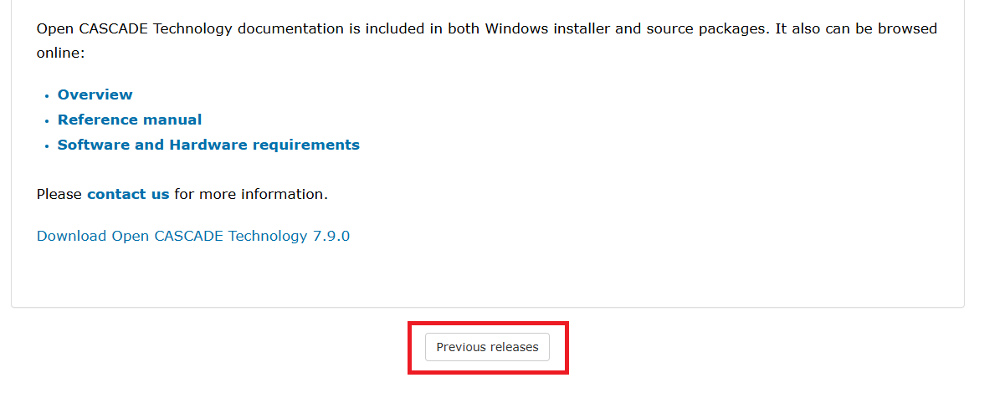
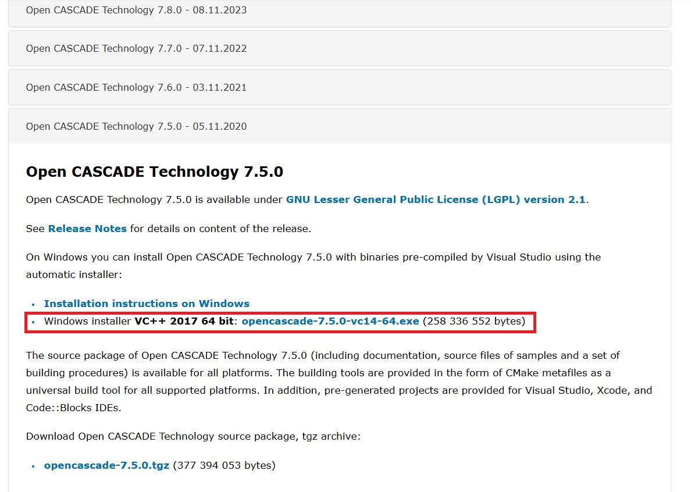
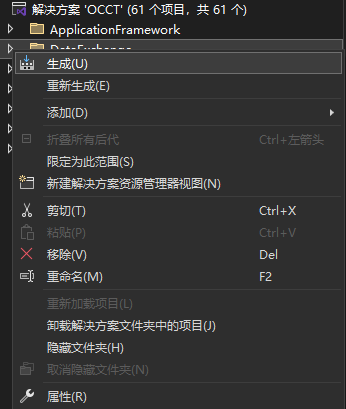

# Open CASCADE Technology 7.5.0 安装

*Xiaoyang Yu, 2025-03-01.*

### 💻 Windows 10 / Windows 11

---

需要提前安装：Visual Studio 2017 或后续版本。

### 下载

首先来到[OCC官网](https://dev.opencascade.org/release)，当前的最新版本是7.9.0。

这里选择安装**Open CASCADE Technology 7.5.0**。拉到最下面，点击 **Previous releases**。

选择预编译版的OCC，点击就可以开始下载。注意：如果是第一次下载，需要注册一个账号，注册流程很简单，一路按照引导使用邮箱注册即可。

---

### 安装

双击打开下载好的可执行文件，修改好安装路径后一路 next 下去就可以了。以下是我的安装路径：

打开编辑系统环境变量→环境变量→系统变量→Path，添加环境变量：

这些是OCC的路径：

这些是编译OCC依赖库的路径：

配置好环境变量后，建议**重启电脑**，保证环境变量生成有效。打开`E:\Library\OpenCASCADE-7.5.0-vc14-64`文件夹，双击打开批处理文件`msvc.bat`。

此时会打开一个 Visual Studio 解决方案，依次右键→生成即可。

顺利的话，这一步不会出现报错。如果出现报错，请检查是否**缺少环境变量**。

---

### 测试

这里给出了一个测试程序，代码来源于俄罗斯大佬 **Quaoar** 的OCCT课程：[课程主页](https://analysissitus.org/forum/index.php?threads/youtube-lessons.3/) | [代码仓库](https://gitlab.com/ssv/lessons)。如果OCC安装成功，使用CMake配置完成环境后，运行程序，程序界面如下：

