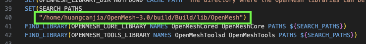

# OpenMesh 库配置记录

本文档为配置 OpenMesh 库的记录，[[官网]](https://www.graphics.rwth-aachen.de/software/openmesh/)

---

Canjia Huang <<canjia7@gmail.com>> last update 18/3/2025

# :penguin: Ubuntu

- 操作系统：Ubuntu 20.04.5 LTS
- OpenMesh 版本：11.0（不同版本的各个文件目录可能略有不同，需进行确认）

## 配置步骤（源码编译）

参考 [[官网/Download]](https://www.graphics.rwth-aachen.de/software/openmesh/download/) [[1]](https://www.oryoy.com/news/ubuntu-xi-tong-qing-song-shang-shou-pei-zhi-openmesh-yi-bu-dao-wei-zhi-nan.html)

1. 将 OpenMesh 源码下载到本地，可以使用 `git clone`：

    ```
    git clone --recursive https://gitlab.vci.rwth-aachen.de:9000/OpenMesh/OpenMesh.git
    ```

    并进入该文件夹：

    ```
    cd OpenMesh
    ```

2. 在项目根目录新建 “build” 文件夹，并进入，使用 CMake 进行生成：

    ```
    cd build
    cmake ..
    ```

    过程中可能需要安装一些常用的依赖库

3. 生成完毕后，进行编译：

    ```
    make
    ```

4. 编译完成后，进行安装：

    - 4.1 如果有 root 权限，直接执行：

        ```
        sudo make install
        ```
    
    - 4.2 如果没有 root 权限，可能会安装失败，此时如果要在其他 CMake 项目中添加 OpenMesh 库，可以按如下操作（此处的示例项目为 [libQEx](https://github.com/hcebke/libQEx/blob/master/cmake/FindOpenMesh.cmake)，其中寻找 OpenMesh 的文件为 [libQEx/cmake/FindOpenMesh.cmake](https://github.com/hcebke/libQEx/blob/master/cmake/FindOpenMesh.cmake)）：

        1. 修改该项目中的 “FindOpenMesh.cmake” 文件，在其中寻找 `OPENMESH_INCLUDE_DIR` 变量的目录中添加 “xxx/OpenMesh/src 的目录（这里的 XXX 需要替换为实际目录，这个例子里面，添加的目录下需要有 “OpenMesh/Core/Mesh/PolyMeshT.hh” 文件），示例如下（绿框处为需要添加的部分）：

            

        2. 修改该项目中的 “FindOpenMesh.cmake” 文件，在其中寻找 `OPENMESH_CORE_LIBRARY` 和 `OPENMESH_TOOLS_LIBRARY` 的目录中添加 "xxx/OpenMesh/build/Build/lib/" 的目录（这里的 XXX 需要替换为实际目录），示例如下（绿框处为需要添加的部分）：

            

        3. 如果该文件中存在判断 `OPENMESH_FOUND` 是否为 true 的语句，需要进行调整，因为可能从源码编译的 “FindOpenMesh.cmake” 文件不会定义该变量