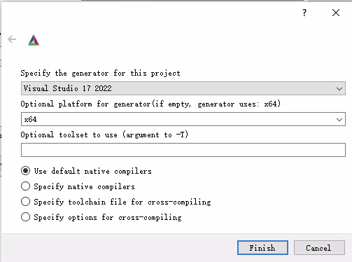
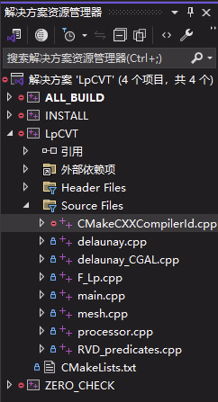
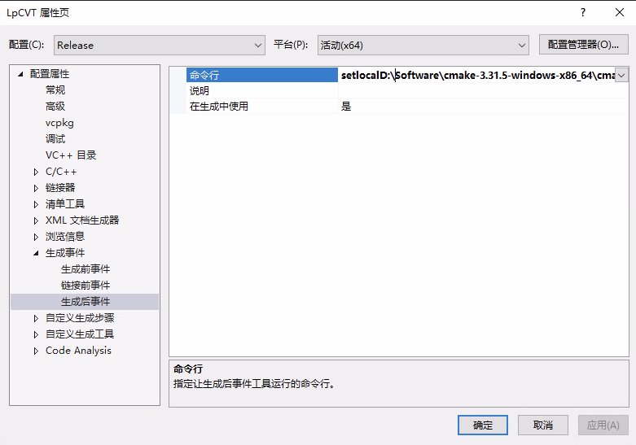

# LpCVT 项目配置记录

Canjia Huang <<canjia7@gmail.com>> last update 4/3/2025

:star: 我对 [secantalpha/LpCVT](https://github.com/secantalpha/LpCVT) 的版本进行了重构，重构版本为 [Bigger-and-Stronger/LpCVT](https://github.com/Bigger-and-Stronger/LpCVT)，该版本配置更加方便，并添加了许多可以直接使用的操作（包括 LpCVT 的迭代优化）

该版本适用于所有平台，配置步骤可以参考 [Bigger-and-Stronger/LpCVT/README.md](https://github.com/Bigger-and-Stronger/LpCVT/blob/main/README.md)，具体的：Windows 上的配置步骤与本文档类似；macOS 上的配置步骤可以参考 [macos-build.yml](https://github.com/Bigger-and-Stronger/LpCVT/blob/main/.github/workflows/macos-build.yml)

---

Canjia Huang <<canjia7@gmail.com>> last update 1/3/2025

本文档为配置文章 "**Lp Centroidal Voronoi Tessellation and its applications**" 的代码的记录 [[Paper]](https://dl.acm.org/doi/abs/10.1145/1778765.1778856) [[Code]](https://app.box.com/s/vh9mz9eody9xuxj7xtp2f19d8d7gya97)

```
@article{10.1145/1778765.1778856,
    author = {L\'{e}vy, Bruno and Liu, Yang},
    title = {Lp Centroidal Voronoi Tessellation and its applications},
    year = {2010},
    issue_date = {July 2010},
    publisher = {Association for Computing Machinery},
    address = {New York, NY, USA},
    volume = {29},
    number = {4},
    issn = {0730-0301},
    url = {https://doi.org/10.1145/1778765.1778856},
    doi = {10.1145/1778765.1778856},
    abstract = {This paper introduces Lp-Centroidal Voronoi Tessellation (Lp-CVT), a generalization of CVT that minimizes a higher-order moment of the coordinates on the Voronoi cells. This generalization allows for aligning the axes of the Voronoi cells with a predefined background tensor field (anisotropy). Lp-CVT is computed by a quasi-Newton optimization framework, based on closed-form derivations of the objective function and its gradient. The derivations are given for both surface meshing (Ω is a triangulated mesh with per-facet anisotropy) and volume meshing (Ω is the interior of a closed triangulated mesh with a 3D anisotropy field). Applications to anisotropic, quad-dominant surface remeshing and to hexdominant volume meshing are presented. Unlike previous work, Lp-CVT captures sharp features and intersections without requiring any pre-tagging.},
    journal = {ACM Trans. Graph.},
    month = jul,
    articleno = {119},
    numpages = {11},
    keywords = {Centroidal Voronoi Tessellation, anisotropic meshing, hex-dominant meshing, quad-dominant meshing}
}
```

:skull: 由于原文的源码较为久远，其中部分代码可能与最新的 CGAL 库并不兼容，可以构建 [secantalpha/LpCVT](https://github.com/secantalpha/LpCVT) 的版本，该版本作了些许修改以使得代码适应于 CGAL 5.0 以上，不过仅按照其 README 中的步骤可能还是会出现一些错误，具体配置步骤可以参考如下：

# :computer: Windows

- 操作平台：Windows 10
- CMake: 3.31.5
- IDE: Microsoft Visual Studio Community 2022 (64 位) - 版本 17.12.2

## 前置步骤

需先成功配置 **CGAL** 库以及 **Boost** 库

## 配置步骤

1. 将项目 [secantalpha/LpCVT](https://github.com/secantalpha/LpCVT) 下载到本地，也可以通过 git 操作：
   
   ```
   git clone https://github.com/secantalpha/LpCVT.git
   ```

2. 在路径 `***\LpCVT\sources\LpCVT` 下新建文件夹 **build**，打开 **cmake-gui**，其中的 "Where is the source code" 和 "Where to build the binaries" 分别填写路径 `***\LpCVT\sources\LpCVT` 和 `***\LpCVT\sources\LpCVT\build`（ :warning: 此处的星号需要根据实际情况进行替换），如下：

    

3. 使用 CMake 进行 configure，其中 "Optional platform for generator" 选择 **x64**，如下：

    

4. configure 完成后，使用 generate 生成项目
5. 在 `***\LpCVT\sources\LpCVT\build` 目录下找到生成的 **LpCVT.sln** 解决方案，使用 Visual Studio 打开
6. 配置选择 **Release**，平台选择 **x64**，于 **ALL_BUILD** 项目上右键选择 **生成**（此步骤可能会出现很多问题，具体解决方法参考下面的 [可能出现的问题](#可能出现的问题) 章节）
7. 生成完毕后在 `***\LpCVT\sources\LpCVT\build\Release` 目录下会出现 **LpCVT.exe** 可执行文件
8. 可以进行简单的运行测试，具体可以参考 `***\LpCVT\sources\LpCVT\readme.txt` 文件中的使用说明，或参考下面的 [简单测试](#简单测试) 章节

## 可能出现的问题
- 与 **mpfr** 相关的错误

    例如出现 `语法错误: 标识符"mpfr_srcptr"`、`语法错误: 缺少“；”(在标识符"__mpft_struct"的前面)`等

    需要在附加包含目录中添加 **CGAL** 中与 **gmp** 相关的 include 目录：`***\CGAL-5.6\auxiliary\gmp\include` （此处的星号需要根据实际情况进行替换），如下图（红框处）：

    

    添加后应用，并重新生成 **ALL_BUILD**

- 与 **CMakeCXXCompilerId.obj** 相关的错误
  
    出现错误 `LNK2005 main 已经在 CMakeCXXCompilerId.obj 中定义`

    可以在解决方案窗口中选择 **LpCVT** 解决方案，将其中 **Source Files** 中的 **CMakeCXXCompilerId.cpp** 文件（如下图）进行移除

    

    移除后重新生成 **ALL_BUILD**

- 与命令 `setlocal` 相关的错误

    出现错误 'MSB3073 命令"setlocal'

    是在解决方案 **LpCVT** 的属性中的 **生成事件-生成后事件-命令行** （见下图）中出现的错误，命令行中的第二行是一个路径，出现该问题的原因是该路径中的 **libgmp-10.dll** 的路径错误，需要将其修改为正确的路径

    

    我此处的命令行中的第二行原本为（仅供参考，具体情况因人而异）：

    ```
    D:\Software\cmake-3.31.5-windows-x86_64\cmake-3.31.5-windows-x86_64\bin\cmake.exe -E copy_if_different /lib/libgmp-10.dll D:/LpCVT/sources/LpCVT/build/Release
    ```

    其中 `copy_if_different` 后的路径 `/lib/libgmp-10.dll` 不完整，需要修改，可以在 **CGAL** 库所在文件夹的 **gmp** 相关文件夹中寻找该 **dll** 文件，我此处将修改为 `D:/C_Library/CGAL-5.6/auxiliary/gmp/lib/libgmp-10.dll`（具体路径因人而异），修改后命令行第二行为：

    ```
    D:\Software\cmake-3.31.5-windows-x86_64\cmake-3.31.5-windows-x86_64\bin\cmake.exe -E copy_if_different D:/C_Library/CGAL-5.6/auxiliary/gmp/lib/libgmp-10.dll D:/LpCVT/sources/LpCVT/build/Release
    ```

    修改并应用后重新生成 **ALL_BUILD**

## 简单测试

简单测试该项目程序

1. 打开 Windows Power Shell，在终端中输入指令以进入 `***\LpCVT\sources\LpCVT\build\Release` 目录（星号处需替换为你的项目所在路径，以下指令的位置仅供参考）：
   
   ```
   cd D:\LpCVT\sources\LpCVT\build\Release
   ```

2. 输入：

    ```
    ./LpCVT ../../data/three_holes.obj ../../data/three_holes.pts
    ```

3. 运行成功后，会在 `***\LpCVT\sources\LpCVT\build\Release` 目录下生成结果文件 **cvd.obj**、**rdt.obj**、**rvd.obj**，结果分别如下：

<table>
<tr>
<td>


<td>


<td>


</table>
