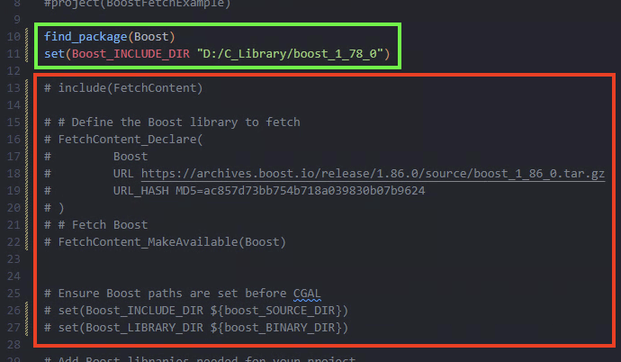

# PCO 项目配置记录

本文档为配置文章 **"PCO: Precision-Controllable Offset Surfaces with Sharp Features"** 的代码的记录 [[Paper]](https://dl.acm.org/doi/10.1145/3687920) [[Project Page]](https://alan-leo-wong.github.io/SIGASIA24-PCO-ProjectPage/) [[Code]](https://github.com/Alan-Leo-Wong/PCO)

```
@article{10.1145/3687920,
    author = {Wang, Lei and Wang, Xudong and Wang, Pengfei and Chen, Shuangmin and Xin, Shiqing and Guo, Jiong and Wang, Wenping and Tu, Changhe},
    title = {PCO: Precision-Controllable Offset Surfaces with Sharp Features},
    year = {2024},
    issue_date = {December 2024},
    publisher = {Association for Computing Machinery},
    address = {New York, NY, USA},
    volume = {43},
    number = {6},
    issn = {0730-0301},
    url = {https://doi.org/10.1145/3687920},
    doi = {10.1145/3687920},
    abstract = {Surface offsetting is a crucial operation in digital geometry processing and computer-aided design, where an offset is defined as an iso-value surface of the distance field. A challenge emerges as even smooth surfaces can exhibit sharp features in their offsets due to the non-differentiable characteristics of the underlying distance field. Prevailing approaches to the offsetting problem involve approximating the distance field and then extracting the iso-surface. However, even with dual contouring (DC), there is a risk of degrading sharp feature points/lines due to the inaccurate discretization of the distance field. This issue is exacerbated when the input is a piecewise-linear triangle mesh.This study is inspired by the observation that a triangle-based distance field, unlike the complex distance field rooted at the entire surface, remains smooth across the entire 3D space except at the triangle itself. With a polygonal surface comprising n triangles, the final distance field for accommodating the offset surface is determined by minimizing these n triangle-based distance fields. In implementation, our approach starts by tetrahedralizing the space around the offset surface, enabling a tetrahedron-wise linear approximation for each triangle-based distance field. The final offset surface within a tetrahedral range can be traced by slicing the tetrahedron with planes. As illustrated in the teaser figure, a key advantage of our algorithm is its ability to precisely preserve sharp features. Furthermore, this paper addresses the problem of simplifying the offset surface's complexity while preserving sharp features, formulating it as a maximal-clique problem.},
    journal = {ACM Trans. Graph.},
    month = nov,
    articleno = {169},
    numpages = {16},
    keywords = {digital geometry processing, polygonal surface, offset, sharp feature, maximal clique}
}
```

---

Canjia Huang <<canjia7@gmail.com>> last update 18/3/2025

# :penguin: Ubuntu

- 操作系统：Ubuntu 20.04.6
- SSH IDE：CLion 2024.3.4

## 配置步骤

1. 于服务器中，按照 [Alan-Leo-Wong/PCO/README.md](https://github.com/Alan-Leo-Wong/PCO/blob/master/README.md)中步骤，执行：

    ```
    git clone --recursive https://github.com/alan-leo-wong/PCO.git
    ```

2. 使用 CLion SSH 连接，`重新加载 CMake 项目`，会自动使用 CMake 进行 configure 和 Generate，依赖库也会自动下载

    - :warning: 因会自动下载依赖库，所以可能遇到网络问题 `Failed to connect to github.com port 443: Connection timed out` 或其他问题

        - 解决方法1：在不同时间段多试几次 :sob:

        - 解决方法2：手动下载依赖库，并更改 “PCO/cmake/external/” 目录下对应库的 ".cmake" 文件

            例如，较常见的是下载 **Boost** 库失败，可以更改该目录下的 "boost.cmake" 文件，具体修改如下图（添加绿色框的内容：具体路径视实际情况而定，并注释红色框的内容）：

            

3. 在 `运行/调试配置` 中选择 `PCO_MAIN` ，并选择 `Release` 模式，进行生成

    - :warning: 可能出现错误 `***/PCO/src/graph/Graph.cpp:6:10: fatal error: utils/LOG.hpp: No such file or directory`

        解决方法是将 “PCO/src/graph/Graph.cpp” 文件的 Line 6 的 `#include "utils/LOG.hpp"` 改为 `#include "utils/Log.hpp"`

    - :warning: 可能出现错误 `***/PCO/src/mesh/SurfaceMesh.cpp:90:50: error: ‘FLT_MIN’ was not declared in this scope`

        解决方法是在 “PCO/src/mesh/SurfaceMesh.cpp” 文件中添加头文件 `#include <float.h>`

    - :warning: 可能出现错误 `***/PCO/src/cgal/CGALProcessor.hpp:24:9: error: ‘size_t’ does not name a type`

        解决方法是在 “PCO/src/cgal/CGALProcessor.hpp” 文件中添加含有 `size_t` 定义的头文件，如添加 `#include <stdio.h>`

    - :warning: 可能出现错误 `FAILED: app/PCO_MAIN`，其中具体原因是关于 `undefined reference to omp_get_num_threads` 类似的问题

        解决方法是在 “PCO/CMakeList.txt” 的前半部分（例如可以在 “# Project settings” 后面，Line 20 左右）添加上 OpenMP 相关的设置：

        ```
        set(CMAKE_C_FLAGS "${CMAKE_C_FLAGS} ${OpenMP_C_FLAGS}")
        set(CMAKE_CXX_FLAGS "${CMAKE_CXX_FLAGS} ${OpenMP_CXX_FLAGS}")
        set(CMAKE_EXE_LINKER_FLAGS "${CMAKE_EXE_LINKER_FLAGS} ${OpenMP_EXE_LINKER_FLAGS}")
        ```
4. 编译成功后，会在 “PCO/cmake-build-release/app“ 目录（具体目录视实际 IDE 情况而定，本文档以此为例）下生成可执行文件 `PCO_MAIN`，进入该目录：

    ```
    cd cmake-build-release/app
    ```

## 测试

1. 这里选择 Thingi10K 数据中的 [104559](104559.stl) 模型进行测试，首先将该模型文件下载至 “PCO/cmake-build-release/app“ 目录中（具体目录视实际情况而定）

2. 参考 [PCO/README.md](https://github.com/Alan-Leo-Wong/PCO/blob/master/README.md)，在终端中执行：

    ```
    ./PCO_MAIN -f 104559.stl -F output.obj -o 2 -d 8 --pmp
    ```

    或

    ```
    ./PCO_MAIN -f 104559.stl -F output.obj -o 2 -d 8 -m -c 170 --pmp
    ```

    操作成功后会在该目录下生成 “output.obj” 文件

# :computer: Windows

- 操作系统：Windows 10
- IDE：Visual Studio 2022

## 配置步骤

1. 将该项目 clone 至本地，并在该项目根目录新建文件夹 `build`（其目录为 "PCO/build"）

2. 使用 CMake-gui（Version: 3.31.5），设置 source code 目录为 "xxx/PCO"，build the binaries 目录为 "xxx/PCO/build"（此处的 xxx 根据实际情况改变），platform for generator 设置为 `x64`，设置完毕后进行 **Configuration**，成功后进行 **Generate**

3. 使用 Visual Studio 2022 打开 “build/PCO.sln” 文件，将 `PCO_MAIN` 设置为启动项目，设置 `Release` 模式，进行编译生成

4. 在 “PCO\build\app\Release” 目录下会生成可执行文件 `PCO_MAIN`，可以使用 powershell 按如上方式进行测试