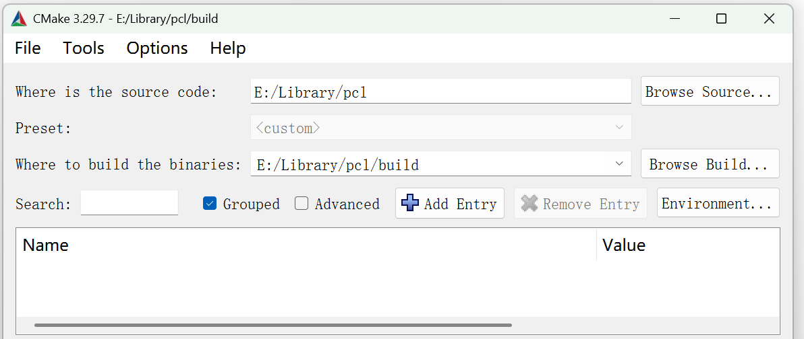
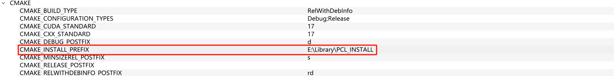
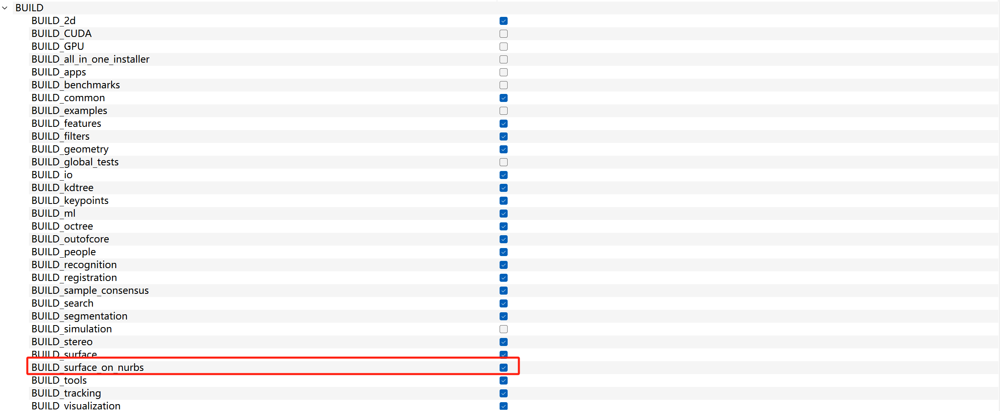
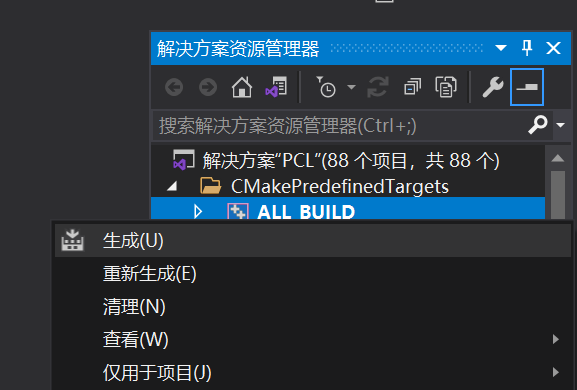
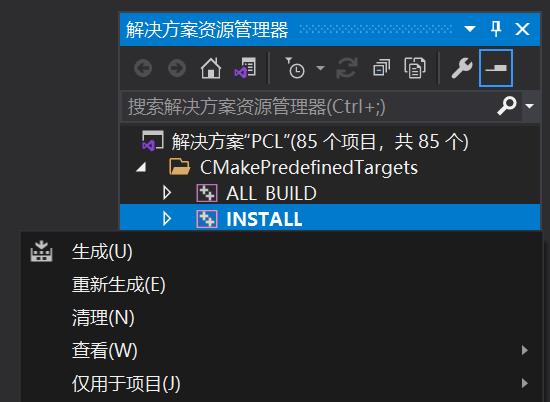
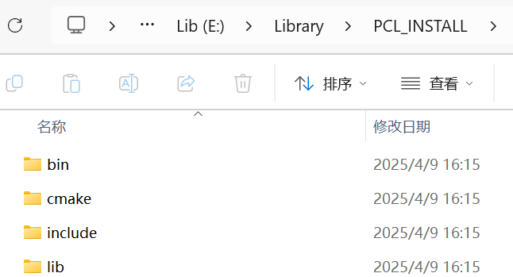

# PCL Windows11 环境配置
Shi Chen, 09/04/2025 12:47

本文配置点云处理库PCL:
- [[Website]](https://pointclouds.org/) | [[Code]](https://github.com/PointCloudLibrary/pcl) | [[Document]](https://pointclouds.org/documentation/)

这里我参考了[官方的Windows配置说明](https://pcl.readthedocs.io/projects/tutorials/en/latest/compiling_pcl_windows.html#compiling-pcl-windows) 

PS:官网文档已经超级详细，其实可以直接食用。

## 其他安装方式说明
可以采用[预编译的二进制包](https://github.com/PointCloudLibrary/pcl/releases)或是[vcpkg](https://github.com/microsoft/vcpkg)直接安装，对于大多数点云处理的需求是可以满足的且十分方便。

笔者因为有尝试**使用NURBS进行曲面拟合**的需求，这个默认选项是没有的，因此直接从源码编译。

## 环境配置与一些说明
0. 准备

    参考[官方文档](https://pcl.readthedocs.io/projects/tutorials/en/latest/compiling_pcl_windows.html#compiling-pcl-windows)，以下是几个必选的依赖：
      - Boost
      - Eigen
      - FLANN
      - VTK
  
    另外，我们这使用的编译工具是：
      - Visual Studio 2019
      - CMake 3.29.7

1. 克隆

    在一个目录下克隆PCL项目，我这里目录是`E:/Library/`：

    ```bash
	    git clone https://github.com/PointCloudLibrary/pcl.git
    ```
2. CMake

    拿出你的CMake，在`pcl`目录下进行编译：

    

    **Configure**后，在 *CMAKE_INSTALL_PREFIX* 中填写安装位置。

    
    
    根据需求选择 *BUILD* 的内容，例如有**NURBS拟合**的需求，则把 *BUILD_surface_on_nurbs* 给勾上。

    

    点击**Generate**后点击**Open Project**，进入Visual Studio。

3. 安装

   在解决方案下点击 *ALL BUILD* 生成，在**Debug**和**Release**两种模式下这么做。

    
    
   然后再点击 *INSTALL* 生成，在**Debug**和**Release**两种模式下这么做。

    

   PS: 这里需要一段漫长的等待。

   完成后，前面 *CMAKE_INSTALL_PREFIX* 中填写的目录下会有安装好的文件：

    

4. 环境变量设置

    新建 `PCL_DIR`，值为 *CMAKE_INSTALL_PREFIX* 中设置的值。

    编辑 `PATH`，在末尾追加 *CMAKE_INSTALL_PREFIX* 中设置的值 + */bin*。

    设置完成后，重启电脑！

## 在你的项目中使用
    
编辑你的CMakeLists.txt:

```bash
        cmake_minimum_required(VERSION 3.10)
        project(MyPCLProject)

        set(CMAKE_CXX_STANDARD 17)

        find_package(PCL REQUIRED)

        include_directories(${PCL_INCLUDE_DIRS})
        link_directories(${PCL_LIBRARY_DIRS})
        add_definitions(${PCL_DEFINITIONS})

        add_executable(MyPCLProject main.cpp)
        target_link_libraries(MyPCLProject ${PCL_LIBRARIES})
```
