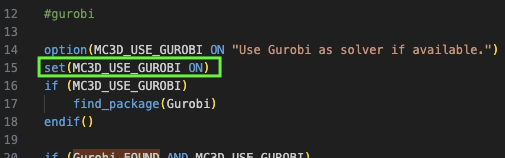

# QGP3D 项目配置记录

本文档为配置文章 **"Volume Parametrization Quantization for Hexahedral Meshing"** 和 **"Integer-Sheet-Pump Quantization for Hexahedral Meshing"** 的代码的记录 [[Paper1]](https://dl.acm.org/doi/10.1145/3528223.3530123) [[Paper2]](https://onlinelibrary.wiley.com/doi/10.1111/cgf.15131) [[Project Page]](https://www.algohex.eu/publications/integer-sheet-pump-quantization-for-hexahedral-meshing/) [[Code]](https://github.com/HendrikBrueckler/QGP3D)

```
@article{10.1145/3528223.3530123,
    author = {Br\"{u}ckler, Hendrik and Bommes, David and Campen, Marcel},
    title = {Volume parametrization quantization for hexahedral meshing},
    year = {2022},
    issue_date = {July 2022},
    publisher = {Association for Computing Machinery},
    address = {New York, NY, USA},
    volume = {41},
    number = {4},
    issn = {0730-0301},
    url = {https://doi.org/10.1145/3528223.3530123},
    doi = {10.1145/3528223.3530123},
    month = jul,
    articleno = {60},
    numpages = {19},
    keywords = {base complex, block decomposition, block-structured, hexahedral mesh, multi-block, t-mesh, volume mesh}
}
```

```
@article{10.1111:cgf.15131,
    journal = {Computer Graphics Forum},
    title = {{Integer-Sheet-Pump Quantization for Hexahedral Meshing}},
    author = {Brückler, Hendrik and Bommes, David and Campen, Marcel},
    year = {2024},
    publisher = {The Eurographics Association and John Wiley & Sons Ltd.},
    ISSN = {1467-8659},
    DOI = {10.1111/cgf.15131}
}
```

---

Canjia Huang <<canjia7@gmail.com>> last update 25/3/2025

# :penguin: Ubuntu

- 操作系统：Ubuntu 20.04.6 LTS

## 预备步骤

- 该项目依赖于 Gurobi 库，安装步骤可参考 [Gurobi 库配置记录](../Gurobi/)

## 配置步骤

1. 将项目下载到本地，在终端中输入：

    ```
    git clone https://github.com/HendrikBrueckler/QGP3D.git
    ```

    并进入该项目目录：

    ```
    cd QGP3D
    ```

2. 新建存放编译文件的目录并进入：

    ```
    mkdir build
    cd build
    ```

3. 使用 CMake 进行 configure：

    ```
    cmake -DGUROBI_BASE=<path/to/gurobi/> ..
    ```

    此处的 `<path/to/gurobi/>` 需要替换为 **Gurobi** 库的安装目录，如我这里改为输入（具体路径依据实际情况而定，需要该目录下含有 “include/gurobi_c++.h” 文件）：

    ```
    cmake -DGUROBI_BASE="/home/huangcanjia/gurobi1201/linux64/" ..
    ```

    - :warning: 可能出现错误 `Could NOT find CoinUtils (missing: CoinUtils_LIBRARY CoinUtils_INCLUDE_DIR)`

        该库并不是必要的，是因为缺乏 **Gurobi** 库而找的替代，该错误在输出中的上面几行应该会有信息 `QGP3D: Not using gurobi, looking for alternatives.`

        - 一种解决方法是在不打算使用 **Gurobi** 库的情况下，安装 **CoinUtils** 库

        - 另一种情况是，在上述指定 `<path/to/gurobi/>` 的正确路径后仍然出现该错误

            定位出现错误信息的位置为 “QGP3D/src/CMakeLists.txt” 文件的 Line 26，是由于该文件的 Line 14 `option(MC3D_USE_GUROBI ON "Use Gurobi as solver if available.")` 定义了 `MC3D_USE_GUROBI` 为 `ON`，但在后续 Line 16 判断 `MC3D_USE_GUROBI` 时该变量值缺变为 `OFF`

            一种简单的解决方法是在 Line 14-16 之间直接添加语句 `set(MC3D_USE_GUROBI ON)`，如下图绿框处：

            

4. 编译：

    ```
    make -j
    ```

5. 编译成功后会在 "QGP3D/build/Build/bin/" 目录下生成可执行文件 “qgp3d_cli”