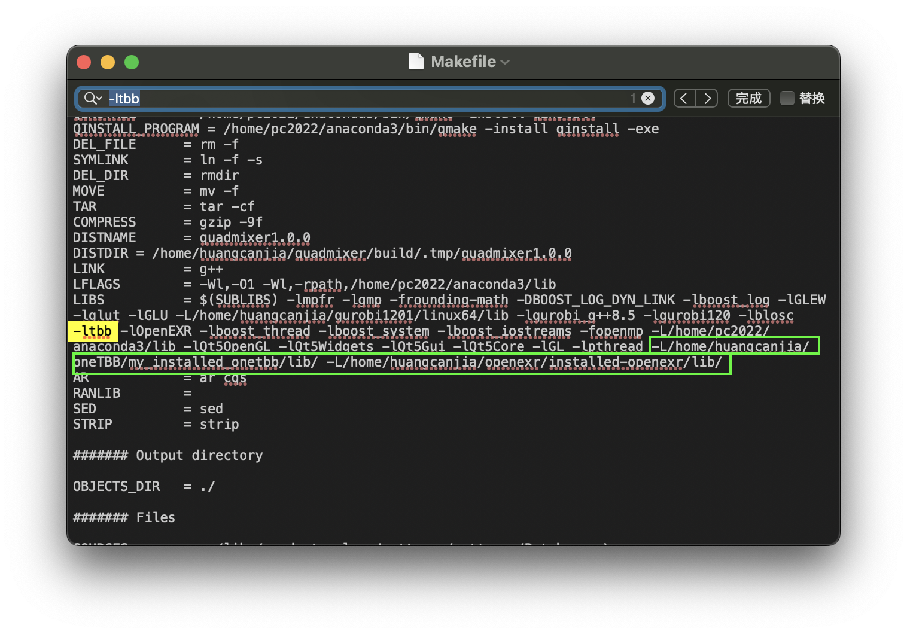

# QuadMixer 项目配置记录

本文档为配置文章 **"QuadMixer: Layout Preserving Blending of Quadrilateral Meshes"** 的代码的记录 [[Paper]](https://dl.acm.org/doi/10.1145/3355089.3356542) [[Code]](https://github.com/stefanonuvoli/quadmixer)

```
@article{10.1145/3355089.3356542,
    author = {Nuvoli, Stefano and Hernandez, Alex and Esperan\c{c}a, Claudio and Scateni, Riccardo and Cignoni, Paolo and Pietroni, Nico},
    title = {QuadMixer: Layout Preserving Blending of Quadrilateral Meshes},
    year = {2019},
    issue_date = {November 2019},
    publisher = {Association for Computing Machinery},
    address = {New York, NY, USA},
    volume = {38},
    number = {6},
    issn = {0730-0301},
    url = {https://doi.org/10.1145/3355089.3356542},
    doi = {10.1145/3355089.3356542},
    journal = {ACM Trans. Graph.},
    month = {nov},
    articleno = {180},
    numpages = {13},
    keywords = {mesh modelling, retopology, quadrangulation}
}
```

---

Canjia Huang <<canjia7@gmail.com>> last update 24/3/2025

# :penguin: Ubuntu

- 操作系统：Ubuntu 20.04.6 LTS

## 预备步骤

- 该项目依赖于 Gurobi 库，安装步骤可参考 [Gurobi 库配置记录](../Gurobi/)
- 该项目还依赖于 eigen, boost, cgal 库

## 配置步骤

1. 将项目下载到本地：

    ```
    git clone --recursive https://github.com/stefanonuvoli/quadmixer
    ```

    进入项目目录：

    ```
    cd quadmixer
    ```

2. 编辑配置文件：

    ```
    vim configuration.pri
    ```

    需要确认并更改下图红框中的各依赖库的路径和版本信息（根据实际情况调整）：

    

    - 其中 `CGAL_PATH` 路径不能设置为 “/usr/include/CGAL”，而应该设定为该目录的上一级目录
    - 其中 `GUROBI_COMPILER` 和 `GUROBI_LIB` 的设置可以参考 **Gurobi** 库的安装目录 “gurobi1201/linux64/lib/” 下的文件，如我在该目录下存在文件 `libgurobi_g++8.5.a` 和 `libgurobi120.so`，以此来确定我这里填写的参数

    修改完毕后保存退出

3. 新建存放编译文件的目录并进入：

    ```
    mkdir build
    cd build
    ```

4. 使用 **qmake** 进行配置：

    ```
    qmake ../quadmixer.pro
    ```

    配置完成后会在本目录下生成 “Makefile” 文件

5. 编译：

    ```
    make -j8
    ```

    - :warning: 可能出现错误 `fatal error: stdlib.h: No such file or directory`

        参考 [ [1] ] [ [2] ]，可能是因为 gcc 的版本过高导致的

        一种解决方法是去掉配置文件 “configuration.pri” 中包含的 “/usr/include” 路径，如可以把 `CGAL_PATH` 的路径去除：

        ```
        vim ../configuration.pri
        ```

        

    - :warning: 可能出现错误 `/usr/bin/ld: cannot find -ltbb`

        需要安装 **tbb** 库，具体可以参考 [TBB 库配置记录](../TBB/)，并且确保环境变量中 `$LD_LIBRARY_PATH` 能够找到链接库 `libtbb.so`

        - 如果安装后仍然无法链接到库，请参考下面 :warning::warning: 问题的解决方案

    - :warning: 可能出现错误 `/usr/bin/ld: cannot find -lHalf`

        需要安装 **OpenEXR** 库，具体可以参考 [OpenEXR 库配置记录](../OpenEXR/)

        需要注意的是，较新版本的 **OpenEXR** 库将 `libHalf` 合并到了 `libOpenEXR` 中，这意味着可能安装完较新版本的 **OpenEXR** 库后仍然无法得到 `libHalf` 文件，此时需要修改 "quadmixer/build/Makefile" 文件，将该文件中的 `-lHalf` 改为 `-lOpenEXR`

        - 如果安装后仍然无法链接到库，请参考下面 :warning::warning: 问题的解决方案

    - :warning::warning: 如果已经安装了以上两个库的情况下仍然出现无法链接到库的情况

        可以修改 "quadmixer/build/Makefile" 文件，找到 `-ltbb` 和 `-lHalf`（或 `-lOpenEXR`）所在的位置，并在该选项最后添加上 `-L/xxx` 来指定这两个库的链接库位置（具体路径根据实际情况而定），如下绿框处：

        

6. 编译完成后，会在 "quadmixer/build" 目录下生成出可执行文件 "quadmixer"

## 测试

打开可执行文件 “quadmixer/build/quadmixer” 会有一个图形界面，但目前还未发现如何成功读入模型... :disappointed:

- :warning: 可能出现错误 `freeglut (./quadmixer): failed to open display ''`

    需要设置 SSH 连接服务器时的 `$DISPLAY` 变量，具体设置参数根据实际情况而定

    - 如果是在 macOS 上通过 SSH 连接服务器的话，需要安装 **XQuartz**，在 [xquartz.org](https://www.xquartz.org) 上下载并安装

        安装完毕使用系统终端 SSH 连接到该服务器，然后再直接打开 “quadmixer” 可执行文件即可

- :warning: 可能出现错误 `libGL error: No matching fbConfigs or visuals found`

    参考 [ [3] ]，在终端中输入：

    ```
    export LIBGL_ALWAYS_INDIRECT=1
    ```

    再重新打开该可执行文件

[1]: https://blog.csdn.net/Kami_Jiang/article/details/123073899
[2]: https://www.jianshu.com/p/94faa8d32519
[3]: https://cloud.tencent.com/developer/ask/sof/116441942