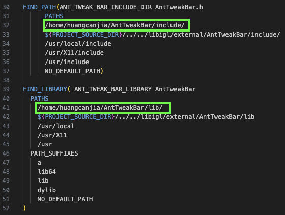
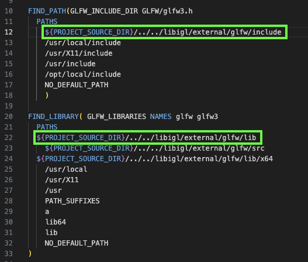

# nPV 项目配置记录

本文档为配置文章 **"Designing N-PolyVector Fields with Complex Polynomials"** 的代码的记录 [[Paper]](https://onlinelibrary.wiley.com/doi/abs/10.1111/cgf.12426) [[Project Page]](https://igl.ethz.ch/projects/complex-roots/) [[Code]](https://igl.ethz.ch/projects/complex-roots/nPV.zip)

```
@article{https://doi.org/10.1111/cgf.12426,
    author = {Diamanti, Olga and Vaxman, Amir and Panozzo, Daniele and Sorkine-Hornung, Olga},
    title = {Designing N-PolyVector Fields with Complex Polynomials},
    journal = {Computer Graphics Forum},
    volume = {33},
    number = {5},
    pages = {1-11},
    doi = {https://doi.org/10.1111/cgf.12426},
    url = {https://onlinelibrary.wiley.com/doi/abs/10.1111/cgf.12426},
    eprint = {https://onlinelibrary.wiley.com/doi/pdf/10.1111/cgf.12426},
    year = {2014}
}
```

Other implementation: [LucasGao2000/4-Rosy-Complex-Poly](https://github.com/LucasGao2000/4-Rosy-Complex-Poly)

---

Canjia Huang <<canjia7@gmail.com>> last update 25/3/2025

# :penguin: Ubuntu

- 操作系统：Ubuntu 20.04.6 LTS

## 配置步骤

1. 首先下载项目代码压缩包 [nPV.zip](https://igl.ethz.ch/projects/complex-roots/nPV.zip)：

    ```
    wget https://igl.ethz.ch/projects/complex-roots/nPV.zip
    ```

    并解压：

    ```
    unzip nPV.zip
    ```

    然后进入项目目录：

    ```
    cd nPV/demos
    ```

2. 新建编译文件存放目录并进入：

    ```
    mkdir build
    cd build
    ```

3. 使用 CMake 进行 configure：

    ```
    cmake -DCMAKE_BUILD_TYPE=Release ..
    ```

    - :warning: 可能出现问题 `could NOT find ANTTWEAKBAR`

        **AntTweakBar** 库已经包含在项目中，但在 “nPV/demos/cmake/FindANTTWEAKBAR.cmake” 文件中的 Line 38-50 中没有找到相关文件以定义 `ANT_TWEAK_BAR_LIBRARY` 变量，因为作者包含的 **AntTweakBar** 库并没有 linux 下编译的链接库文件

        可以自行安装 **AntTweakBar** 库，具体可以参考 [AntTweakBar 库配置记录](../AntTweakBar/)

        然后将安装后的 **AntTweakBar** 库的 “include” 目录和 “lib” 目录添加到 “nPV/demos/cmake/FindANTTWEAKBAR.cmake” 文件的查找路径中，如下图绿框处（具体路径依据实际情况而定）：

        

    - :warning: 可能出现问题 `could NOT find GLFW`

        **GLFW** 库同样已经包含在项目中，但并没有编译适用于 Linux 的链接库，可以自己编译（以下的 “ *** ” 需要根据实际情况进行替换）：

        ```
        cd ***/nPV/libigl/external/glfw
        ```

        ```
        mkdir build
        cd build
        cmake -DCMAKE_INSTALL_PREFIX=../ ..
        make
        make install
        ```

        编译完成后，生成的头文件存放在 “nPV/libigl/external/glfw/include/GLFW/” 目录下，生成的链接库文件存放在 “nPV/libigl/external/glfw/lib/” 目录下

        然后需要修改 "nPV/demos/cmake/FindGLFW.cmake" 文件，以使其能够找到相应的文件，如下绿框处：

        

4. 编译：

    ```
    make
    ```