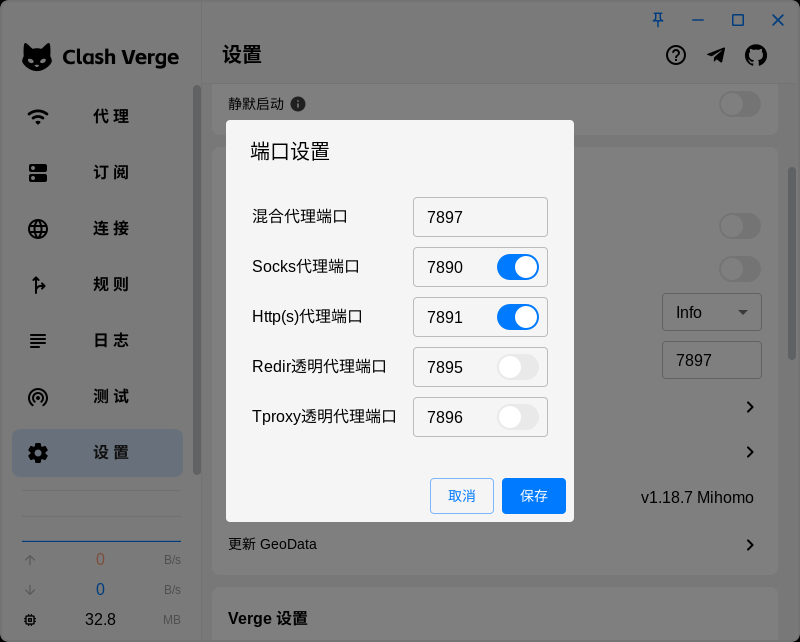

本文档介绍如何在远程服务器上配置代理。

Xuhai Chen <<tuzhong007@gmail.com>> last update 22/3/2025

# :penguin: Ubuntu

- 操作系统：Ubuntu 20.04.6 LTS

## 预备步骤

- 拥有Clash订阅链接

## 配置步骤

1. 下载Clash Verge (v1.7.7)：[clash-verge_1.7.7_amd64.deb](https://github.com/clash-verge-rev/clash-verge-rev/releases), 注意选择版本
2. 在服务器上解压Clash Verge安装包：
    ```
    dpkg-deb -x clash-verge_1.7.7_amd64.deb ~/clash-verge
    ```
3. 运行Clash Verge:
    ```
    cd ~/clash-verge/usr/bin
    ./clash-verge
    ```
4. 在弹出的Clash Verge GUI的“订阅”中，导入订阅链接；在“代理”中，选择想要使用的节点；在“设置”的“端口设置”中，开启系统代理，并且开启"Socks代理端口"与"Http(s)代理端口"的开关，设置代理端口分别为"7890"与"7891"
5. 在需要用到代理的时候（如"git clone ..."之前），设置使用代理：
    ```
    export SOCKS_PROXY="socks5://127.0.0.1:7890"
    export http_proxy="http://127.0.0.1:7891"
    export https_proxy="http://127.0.0.1:7891"
    ```
    若要永久使用代理，则运行
    nano ~/.bashrc，在文件尾部添加以上代理并保存。