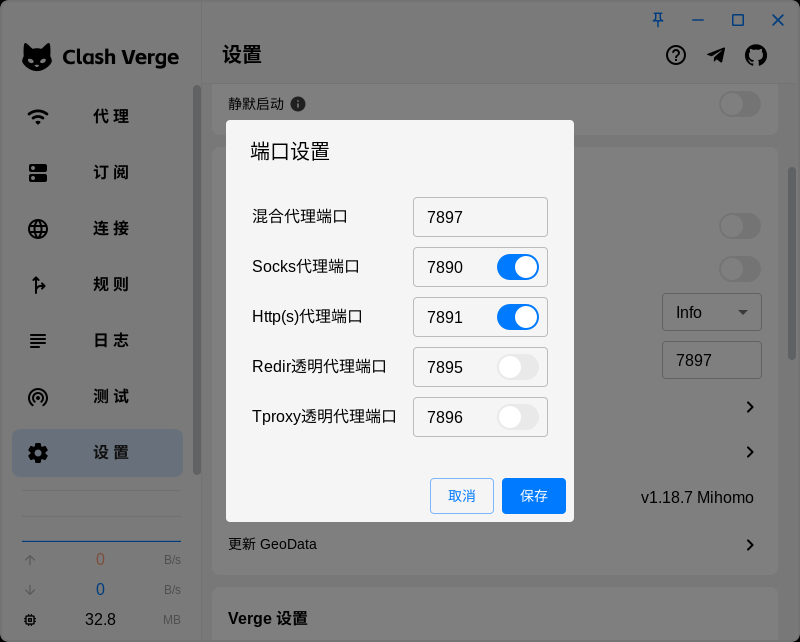
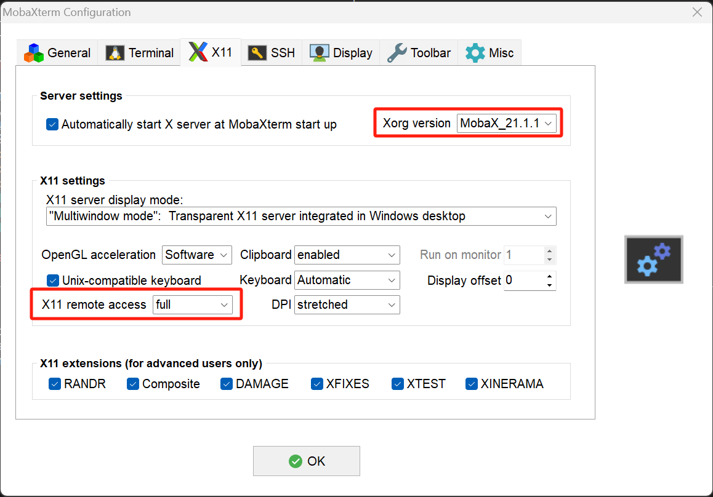

本文档介绍如何在远程服务器上配置代理。

Xuhai Chen <<tuzhong007@gmail.com>> last update 22/3/2025

# :penguin: Ubuntu

- 操作系统：Ubuntu 20.04.6 LTS

## 预备步骤

- 拥有Clash订阅链接

## 配置步骤

1. 下载Clash Verge (v1.7.7)：[clash-verge_1.7.7_amd64.deb](https://github.com/clash-verge-rev/clash-verge-rev/releases), 注意选择版本
2. 在服务器上解压Clash Verge安装包：
    ```
    dpkg-deb -x clash-verge_1.7.7_amd64.deb ~/clash-verge
    ```
3. 运行Clash Verge:
    ```
    cd ~/clash-verge/usr/bin
    ./clash-verge
    ```
4. 在弹出的Clash Verge GUI的“订阅”中，导入订阅链接；在“代理”中，选择想要使用的节点；在“设置”中开启系统代理，并在“设置”的“端口设置”中，开启"Socks代理端口"与"Http(s)代理端口"的开关，设置代理端口分别为"7890"与"7891"
5. 在需要用到代理的时候（如"git clone ..."之前），设置使用代理：
    ```
    export SOCKS_PROXY="socks5://127.0.0.1:7890"
    export http_proxy="http://127.0.0.1:7891"
    export https_proxy="http://127.0.0.1:7891"
    ```
    若要永久使用代理，则运行
    nano ~/.bashrc，在文件尾部添加以上代理并保存。

---

Canjia Huang <<canjia7@gmail.com>> last update 28/3/2025

- :warning: 终端如果没有配置 display 输出的话可能会出现错误 `(clash-verge:1124191): Gtk-WARNING **: 10:14:00.065: cannot open display:`

    如果是在 macOS 上通过 SSH 连接服务器的话，需要安装 **XQuartz**，在 [xquartz.org](https://www.xquartz.org) 上下载并安装

    安装完毕使用系统终端 SSH 连接到该服务器（注意此处连接的命令需要添加 `-Y -C` 选项（大写字母），如 `ssh -Y -C <user name>@<ip>`），然后再直接打开 “clash-verge” 文件即可（可能需要稍等一会才会出现图形界面）

- :warning: 可能出现错误 `libGL error: No matching fbConfigs or visuals found`

    参考 [ [1] ]，在终端中输入：

    ```
    export LIBGL_ALWAYS_INDIRECT=1
    ```

    再重新打开该可执行文件

---

Xiaoyang Yu <<xiaoyangyu37@gmail.com>> last update 23/4/2025

- :warning: Windows 端配置 display 输出，可以选择安装 [MobaXterm](https://mobaxterm.mobatek.net/)，选择 **MobaXterm Home Edition v25.1 (Portable edition)** 版本安装，解压缩后点击可执行文件即可启动终端。在 MobaXterm 终端上运行 Clash Verge，稍后会出现图形界面。
---

Shi Chen <<shichen2001x@gmail.com>> last update 14/5/2025

- :warning: Windows 端在 MobaXterm 终端上运行 Clash Verge，后未出现图形界面。

   参考[ [2] ]后成功显示：
 
   MobaXterm -> Settings -> Configuration -> X11，Xorg version选择MobaX_21.1.12或更高，X11 remote access选择full。

   

[1]: https://cloud.tencent.com/developer/ask/sof/116441942
[2]: https://blog.csdn.net/u014552102/article/details/129998921


