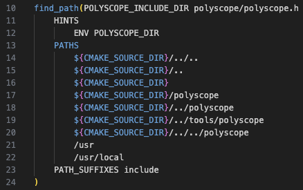

# CubeCover 配置记录

本文档为配置文章 “CubeCover– Parameterization of 3D Volumes” 的（第三方）开源实现 [[doi]](https://onlinelibrary.wiley.com/doi/abs/10.1111/j.1467-8659.2011.02014.x) [[code]](https://github.com/evouga/CubeCover)

```
@article{https://doi.org/10.1111/j.1467-8659.2011.02014.x,
    author = {Nieser, M. and Reitebuch, U. and Polthier, K.},
    title = {CubeCover– Parameterization of 3D Volumes},
    journal = {Computer Graphics Forum},
    volume = {30},
    number = {5},
    pages = {1397-1406},
    keywords = {I.3.5 Computer Graphics: Curve, surface, solid, and object representations—Computational Geometry and Object Modeling},
    doi = {https://doi.org/10.1111/j.1467-8659.2011.02014.x},
    url = {https://onlinelibrary.wiley.com/doi/abs/10.1111/j.1467-8659.2011.02014.x},
    eprint = {https://onlinelibrary.wiley.com/doi/pdf/10.1111/j.1467-8659.2011.02014.x},
    abstract = {Abstract Despite the success of quad-based 2D surface parameterization methods, effective parameterization algorithms for 3D volumes with cubes, i.e. hexahedral elements, are still missing. CubeCover is a first approach for generating a hexahedral tessellation of a given volume with boundary aligned cubes which are guided by a frame field. The input of CubeCover is a tetrahedral volume mesh. First, a frame field is designed with manual input from the designer. It guides the interior and boundary layout of the parameterization. Then, the parameterization and the hexahedral mesh are computed so as to align with the given frame field. CubeCover has similarities to the QuadCover algorithm and extends it from 2D surfaces to 3D volumes. The paper also provides theoretical results for 3D hexahedral parameterizations and analyses topological properties of the appropriate function space.},
    year = {2011}
}
```

---

Canjia Huang <<canjia7@gmail.com>> last update 30/6/2025

# :penguin: Ubuntu

- 操作系统：Ubuntu 20.04.6 LTS

## 配置步骤

1. 将项目下载到本地：

    ```
    git clone https://github.com/evouga/CubeCover.git
    ```

    并进入该目录：
    ```
    cd CubeCover
    ```

2. 新建存放编译结果的目录并进入：

    ```
    mkdir build && cd build
    ```

3. 使用 CMake 进行 configure：

    ```
    cmake ..
    ```

    - :warning: 可能出现错误 `Could NOT find GUROBI (missing: GUROBI_LIBRARY)`

        需要配置 **Gurobi** 库，具体可以参考 [Gurobi 库配置记录](../Gurobi/)

        配置完成后（并正确设置了环境变量 `GUROBI_HOME`），可能还是会出现找不到 **Gurobi** 库的问题，需要修改 “CubeCover/cmake/FindGUROBI.cmake” 文件，在该文件的 Line 37 处添加所配置 **Gurobi** 库的对应版本（如我这里配置的 **Gurobi** 库的 “lib” 目录下的有着文件 "libgurobi120.so"，所以添加 “gurobi120”）

        

        修改完成后删除 build 目录，并重新从第 2 步开始执行

    - :warning: 可能出现以下错误 

        ```
        CMake Error: The following variables are used in this project, but they are set to NOTFOUND.
        Please set them or make sure they are set and tested correctly in the CMake files:
        GUROBI_LIBRARY (ADVANCED)
            linked by target "cubecover" in directory /home/huangcanjia/CubeCover
        ```

        删除 build 目录，并重新从第 2 步开始执行

    - :warning: 可能出现错误 `polyscope not found (missing: POLYSCOPE_INCLUDE_DIR)`

        需要配置 **polyscope** 库，具体可以参考 [polyscope 配置记录](../polyscope/)

        只需要将该库下载到 root 目录下，该项目的 “FindPolyscope.cmake” 就可以自动识别到其路径，或者手动设置系统环境变量 `POLYSCOPE_DIR`

        

        下载完毕后重新使用 CMake 进行 configure

4. 编译：

    ```
    make -j
    ```

    - :warning: 可能出现错误 `error: ‘assert’ was not declared in this scope`

        需要在对应文件中添加头文件 `cassert`，具体来说，在文件 “CubeCover/src/AssignmentGroup.cpp”, "CubeCover/src/Integration.cpp"， “CubeCover/src/SurfaceExtraction.cpp” 的开头添加 `#include <cassert>`

    编译完成后，可执行文件存放在 “CubeCover/build/tools” 中