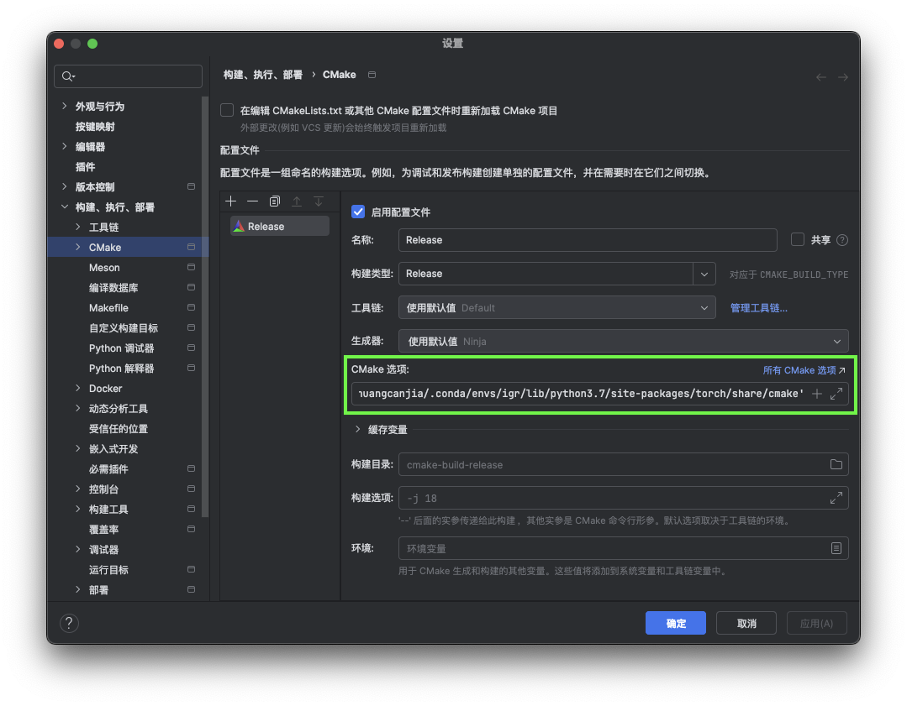

# Libtorch 配置记录

本文档为配置 Libtorch 库的记录

---
Canjia Huang <<canjia7@gmail.com>> last update 27/3/2025

# :penguin: Ubuntu

- 操作系统：Ubuntu 20.04.6 LTS
- SSH IDE：CLion 2024.3.4 (on macOS)

## 配置记录（from Pytorch）

该步骤是在已经安装了 **Pytorch** 的前提下进行的， **Libtorch** 会在 **Pytorch** 安装的同时被安装，以下步骤参考 [ [1] ]

1. 如果 pytorch 是安装在某个 conda 环境中的，需要先进入该环境（本文档例子的虚拟环境变量名称为 “igr”），然后可以进入 python 环境中使用 **torch** 库的指令来查看配套安装的 **Libtorch** 的 configure 路径：

    ```
    python
    ```

    ```
    import torch
    torch.utils.cmake_prefix_path
    ```

    如我这里输出的目录为（以实际情况为准，本文档以此为例）：

    ```
    /home/huangcanjia/.conda/envs/igr/lib/python3.7/site-packages/torch/share/cmake
    ```

2. 使用 CMake 进行 configure 时添加上一步输出的 **Libtorch** 路径为 `CMAKE_PREFIX_PATH` 选项（此处路径需要根据实际情况调整）：

    ```
    -DCMAKE_PREFIX_PATH='/home/huangcanjia/.conda/envs/igr/lib/python3.7/site-packages/torch/share/cmake'
    ```

    具体到 **CLion** 中，在 `编辑CMake配置文件` 的 `CMake选项` 中添加（下图绿框处）：

    

3. 在 CMakeLists.txt 中添加使用 **Libtorch** 库的相应命令：

    在寻找第三方库处：

    ```
    find_package(Torch REQUIRED)
    ```

    在链接库处：

    ```
    target_link_libraries(${PROJECT_NAME} ${TORCH_LIBRARIES})
    ```

    - :warning: 可能出现错误 `PyTorch requires CUDA 10.2 or above.`

        这是因为 CUDA 版本太低，需要安装更高版本的 CUDA

        如果存在多个 CUDA 版本，可以手动指定要使用的 CUDA 版本，具体参考 [ [2] ]，需在 `find_package(Torch)` 前添加指令（具体路径根据实际情况确定）：
        
        ```
        set(CUDA_TOOLKIT_ROOT_DIR /usr/local/cuda-12.2/)
        ```
    
    - :warning: 可能出现错误 `Caffe2: Cannot find cuDNN library.  Turning the option off`

        需要安装 **cuDNN**（如果你使用的 **Pytorch** 是在某个 conda 环境中的，可能需要激活该环境再安装），在终端中输入：

        ```
        conda install cudnn
        ```

        安装完毕后的头文件和链接库会分别位于 “xxx/.conda/envs/<虚拟环境名称>/include” 和 “xxx/.conda/envs/<虚拟环境名称>/lib“ 目录下

        然后在 第2步 的 `CMake选项` （如果使用终端的话，直接在 CMake 进行 configure 的指令后面添加）中添加（具体路径以实际情况为准，此处的 “igr” 为虚拟环境名称；需要在该目录存在 “lib/libcudnn.so” 文件）：

        ```
        -DCUDNN_ROOT='/home/huangcanjia/.conda/envs/igr'
        ```

    - :warning: 可能出现错误 ` Target "cmTC_82644" requires the language dialect "CUDA20" (with compiler extensions).  But the current compiler "NVIDIA" does not support this, or CMake does not know the flags to enable it.`

        可以按照以下方法解决，按顺序尝试检查调整（我在此处使用第一个方案解决）

        - 手动指定 **nvcc** 位置，在 第2步 的 `CMake选项` （如果使用终端的话，直接在 CMake 进行 configure 的指令后面添加）中添加（具体路径以实际情况为准）：

            ```
            -DCMAKE_CUDA_COMPILER='/usr/local/cuda-12.2/bin/nvcc'
            ```

        - 更新 CMake 版本（可能要大于 3.25）
        - 提高 **nvcc** 版本
        - 一种解决方法是调低 C++ 标准版本，此处我是因为在 “CMakeLists.txt” 中设置了使用 C++20，调低即可（此处我调整为 C++14）


    针对以上定义，可以在 CMakeLists 中添加：

    ```
    set(CUDA_TOOLKIT_ROOT_DIR /usr/local/cuda-12.2/)
    set(CMAKE_CUDA_COMPILER "/usr/local/cuda-12.2/bin/nvcc")
    set(CUDNN_ROOT "/home/huangcanjia/.conda/envs/igr")
    set(Torch_DIR "/home/huangcanjia/.conda/envs/igr/lib/python3.7/site-packages/torch/share/cmake/Torch")
    include_directories("/home/huangcanjia/.conda/envs/igr/lib/python3.7/site-packages/torch/include")
    include_directories("/home/huangcanjia/.conda/envs/igr/lib/python3.7/site-packages/torch/include/torch/csrc/api/include")
    ```

    其中 `torch/torch.h` 文件可能不在一般路径下，需要通过 `find . -name "torch.h"` 找到具体位置，并添加到 `include_directories` 中

## 测试

在 C++ 程序中添加头文件 `#include "torch/torch.h"` 使用

- :warning: 如果在使用 `forward()` 等函数时出现内存溢出的直接跳出错误，可能是 **Libtorch** 版本错误导致的，需要更换版本

[1]: https://zhuanlan.zhihu.com/p/609288586
[2]: https://zhuanlan.zhihu.com/p/437301459