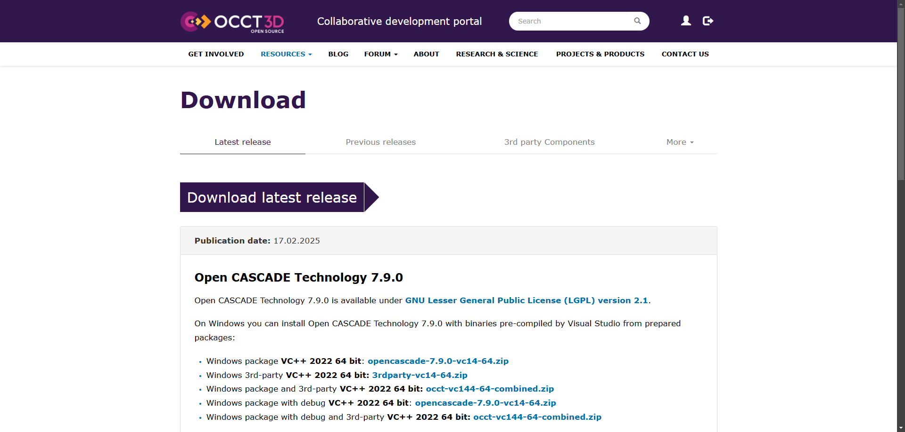
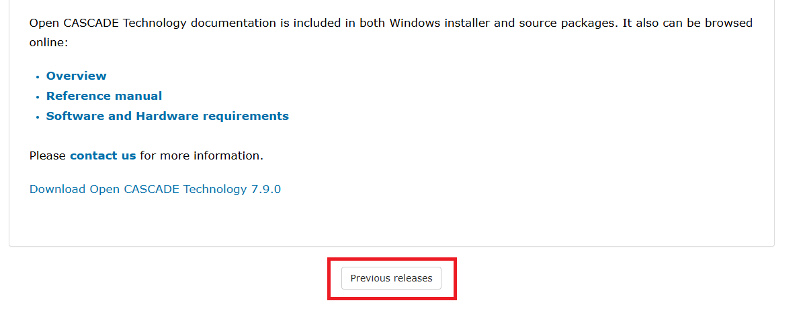
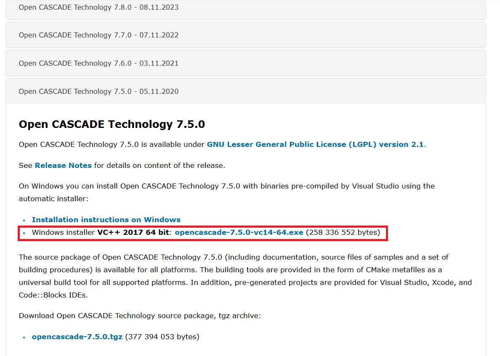
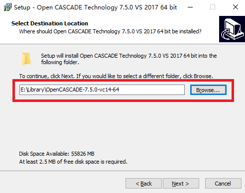
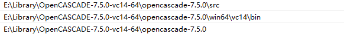
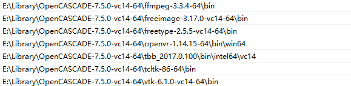
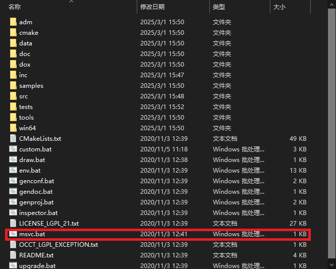
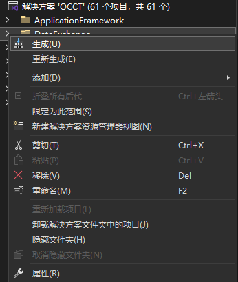
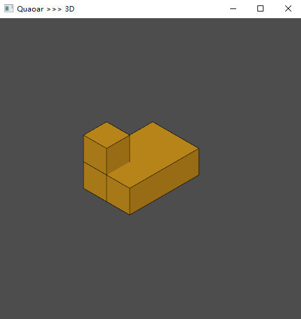

# Open CASCADE Technology 7.5.0 安装

Canjia Huang <<canjia7@gmail.com>> last update 18/4/2025
<a id="ubuntu"></a>
## :penguin: Ubuntu

- 操作系统：Ubuntu 20.04.5 LTS

### 预备步骤

需要安装一些第三方依赖库：

TCL 和 TK（可以参考 [TCL, TK 解释器配置记录](../TCL-TK/)）

### 配置步骤

参考 [ [1] ]

1. 在官网 https://dev.opencascade.org/release 上下载源码（具体链接根据实际情况而定）：

    ```
    wget https://github.com/Open-Cascade-SAS/OCCT/archive/refs/tags/V7_9_0.tar.gz
    ```

    解压（具体文件名称根据实际情况而定）：

    ```
    tar -xvf OCCT-7_9_0.tar
    ```

    进入库目录：

    ```
    cd OCCT-7_9_0
    ```

2. 如果没有 root 权限，新建一个存放编译结果的目录：

    ```
    mkdir OCCT-installed
    ```

3. 新建存放编译过程文件的目录：

    ```
    mkdir build
    ```

    并进入：

    ```
    cd build
    ```

4. 使用 CMake 进行 configure：

    需要额外设置一些路径：

    - 需要设置 `3RDPARTY_TCL_INCLUDE_DIR` 选项为 **TCL** 库的安装路径（具体根据实际情况而定）：

        ```
        -D3RDPARTY_TCL_INCLUDE_DIR=/home/huangcanjia/tcl8.6.16/TCL-installed/include
        ```
    - 需要设置 `3RDPARTY_TK_INCLUDE_DIR` 选项为 **TCL** 库的安装路径（具体根据实际情况而定）：

        ```
        -D3RDPARTY_TK_INCLUDE_DIR=/home/huangcanjia/tk8.6.16/TK-installed/include
        ```

    因此完整的需要执行的指令为：

    ```
    cmake -DINSTALL_DIR=/home/huangcanjia/OCCT-7_9_0/OCCT-installed/ -D3RDPARTY_TCL_INCLUDE_DIR=/home/huangcanjia/tcl8.6.16/TCL-installed/include -D3RDPARTY_TK_INCLUDE_DIR=/home/huangcanjia/tk8.6.16/TK-installed/include ..
    ```

5. 编译：

    ```
    make -j
    ```

    - :warning: 可能出现错误 `../../lin64/gcc/lib/libTKDraw.so.7.9.2: undefined reference to Tcl_StaticLibrary`

        该问题可能是由于 TCL 库的版本过高导致的，可以通过在 CMake configure 指令的最后添加选项 `-DBUILD_MODULE_Draw=OFF` 来临时禁用该模块

    - :warning: 如果遇到与 **TCL** 或 **TK** 库相关的错误

        解决方法是重新执行 `make` 指令（不断重复执行，直到没有错误为止...）
    
    - :warning: 如果遇到错误 `internal compiler error: Segmentation fault`

        可能是因为编译资源不足，不要用多线程编译，使用单线程编译 `make` 或 `make -j1`

6. 安装：

    ```
    make install
    ```

[1]: https://www.cnblogs.com/ziangshen/articles/17633051.html

---

*Xiaoyang Yu, 2025-03-01.*

### 💻 Windows 10 / Windows 11

---

需要提前安装：Visual Studio 2017 或后续版本。

### 下载

首先来到[OCC官网](https://dev.opencascade.org/release)，当前的最新版本是7.9.0。



这里选择安装**Open CASCADE Technology 7.5.0**。拉到最下面，点击 **Previous releases**。



选择预编译版的OCC，点击就可以开始下载。注意：如果是第一次下载，需要注册一个账号，注册流程很简单，一路按照引导使用邮箱注册即可。



---

### 安装

双击打开下载好的可执行文件，修改好安装路径后一路 next 下去就可以了。以下是我的安装路径：



打开编辑系统环境变量→环境变量→系统变量→Path，添加环境变量：

这些是OCC的路径：


这些是编译OCC依赖库的路径：


配置好环境变量后，建议**重启电脑**，保证环境变量生成有效。打开`E:\Library\OpenCASCADE-7.5.0-vc14-64\opencascade-7.5.0`文件夹，双击打开批处理文件`msvc.bat`。



此时会打开一个 Visual Studio 解决方案，依次右键→生成即可。

如果没有打开解决方案，尝试使用 cmd 打开，查看报错：

```bash
D:\Library\OpenCASCADE-7.5.0-vc14-64\opencascade-7.5.0>.\msvc.bat
Error: Could not find MS Visual Studio (vc141)
For VS 2010-2015, check relevant environment variable (e.g. VS100COMNTOOLS)
```

在控制面板-程序中右键 Visual Studio，修改程序，安装 MSVC vc141，安装后在 cmd 中输入：
```bash
set "VCVER=vc14-1"
set "DevEnvDir=D:\Software\VS\community\Common7\IDE"
.\msvc.bat
```



顺利的话，这一步不会出现报错。如果出现报错，请检查是否**缺少环境变量**。

---

### 测试

这里给出了一个测试程序，代码来源于俄罗斯大佬 **Quaoar** 的OCCT课程：[课程主页](https://analysissitus.org/forum/index.php?threads/youtube-lessons.3/) | [代码仓库](https://gitlab.com/ssv/lessons)。如果OCC安装成功，使用CMake配置完成环境后，运行程序，程序界面如下：



---
## 🍎MacOS
*Jinyi Huang, 2026-01-11.*
- 操作平台：MacBook Air (Apple M4) - macOS 26.2
- CMake 版本：3.20.0-rc1 (4.0 以上的 CMake 似乎不能编译 OCCT 7.5.0)

### OCCT 7.5.0
参考[Ubuntu](#ubuntu)
#### 🔧下载安装
1.下载源码
```
wget https://github.com/Open-Cascade-SAS/OCCT/archive/refs/tags/V7_5_0.tar.gz
```
2.解压
```
tar -xvf V7_5_0.tar.gz
```
3.进入库目录

解压后目录名为 OCCT-7_5_0
```
cd OCCT-7_5_0
```
4.进入 build 文件夹
```
mkdir OCCT-installed
mkdir build
cd build
```
5.构建
（这里我采用了 macOS 的 tcl-tk 库，不需要指定路径，不用另外安装）
```
cmake .. \
 -DCMAKE_BUILD_TYPE=Release \
 -DCMAKE_INSTALL_PREFIX=~/OCCT-7_5_0/OCCT-installed \
 -DUSE_FREETYPE=ON \
 -DCMAKE_MACOSX_RPATH=ON
```
6.编译
```
make -j 
```
7.安装
```
make install
```

#### 💡常见问题
如果编译过程中遇到了 `.../OCCT-7_5_0/src/StdPrs/StdPrs_BRepFont.cxx:456:17: error:cannot initialize a variable of type 'const char *' with an rvalue of type 'unsigned char *'` 
打开文件
```
.../OCCT-7_5_0/src/StdPrs/StdPrs_BRepFont.cxx
```
搜索以下代码：
```
const char* aTags      = &anOutline->tags[aStartIndex];
```
将其改为：
```
const unsigned char* aTags = &anOutline->tags[aStartIndex];
```
保存后继续 `make`即可

#### 🙋🏻其他问题 参考[Ubuntu](#ubuntu)
 -  ⚠️ 可能出现错误 `../../lin64/gcc/lib/libTKDraw.so.7.9.2: undefined reference to Tcl_StaticLibrary`
	该问题可能是由于 TCL 库的版本过高导致的，可以通过在 CMake configure 指令的最后添加选项 `-DBUILD_MODULE_Draw=OFF` 来临时禁用该模块
- ⚠️ 如果遇到与 **TCL** 或 **TK** 库相关的错误
	解决方法是重新执行 `make` 指令（不断重复执行，直到没有错误为止...）
- ⚠️ 如果遇到错误 `internal compiler error: Segmentation fault`
	可能是因为编译资源不足，不要用多线程编译，使用单线程编译 `make` 或 `make -j1`

--- 

### OCC框架配置
配置项目之前需要确保项目的 CMakeLists.txt 是新版的 （旧版只支持 Windows 配置）
#### 🧑🏻‍💻准备工作
1.安装 MacOS 基础开发工具
```
xcode-select --install
```
2.安装可选的第三方工具：
```
brew install ninja pkg-config
```
3.安装 qt 与 eigen 库(必备):
```
brew install qt@5 eigen
```
4.如果需要 omp 并行，安装libomp
```
brew install libomp
```
#### 🏃 配置
首先要克隆一个 XMUCG OCCT 框架的仓库
```
git clone ... 
```

**方案1** 

1.进入目录
```
cd [克隆的仓库]
```
2.清理 build（如有）
```
rm -rf build
```
3.构建

(1)找到 OCCT 的安装位置

按照上面的步骤就是 `.../OCCT-7_5_0/OCCT-installed`

那么这里的参数就是 `.../OCCT-7_5_0/OCCT-installed/lib/cmake/opencascade`

(2)找到 qt5 和 eigen 的安装位置

如果是 homebrew 安装,应该在 `/opt/homebrew/opt/qt@5`  和 `/opt/homebrew/opt/eigen/include/eigen3`

把上述位置作为参数填入 cmake

```
cmake -S . -B build -G Ninja \
  -DCMAKE_BUILD_TYPE=Release \
  -DOpenCASCADE_DIR=.../OCCT-7_5_0/OCCT-installed/lib/cmake/opencascade \
  -DCMAKE_PREFIX_PATH=/opt/homebrew/opt/qt@5 \
  -DEIGEN3_INCLUDE_DIR=/opt/homebrew/opt/eigen/include/eigen3

cmake --build build --parallel
```
4.运行
```
./build/bin/OCC-project
```
💡debug 版本将构建的第二行 `-DCMAKE_BUILD_TYPE=Release` 改为  `-DCMAKE_BUILD_TYPE=Debug`

**方案 2**

用[CLion](https://www.jetbrains.com/clion/promo/?source=google&medium=cpc&campaign=AMER_en_US-PST+MST_Clion_Branded&term=clion&content=489240779486&gad_source=1&gad_campaignid=11960744618&gbraid=0AAAAADloJziZ5y-cTcTJRVYNlP86Xomj9&gclid=Cj0KCQiAsY3LBhCwARIsAF6O6XgNeb6f6Db4JSdCxOQzbuVQ6dM38dQNhb8_MC9hMITTWhOq2Ojn7mAaAhWlEALw_wcB)打开仓库，点击项目向导左侧 ➕ 号增加 Release 配置，然后在 **2 个配置** 的右侧 “CMake选项“ 中输入（这里的路径同方案 1）
```
  -DOpenCASCADE_DIR=.../OCCT-7_5_0/OCCT-installed/lib/cmake/opencascade \
  -DCMAKE_PREFIX_PATH=/opt/homebrew/opt/qt@5 \
  -DEIGEN3_INCLUDE_DIR=/opt/homebrew/opt/eigen/include/eigen3
```


点击”Run"即可运行
