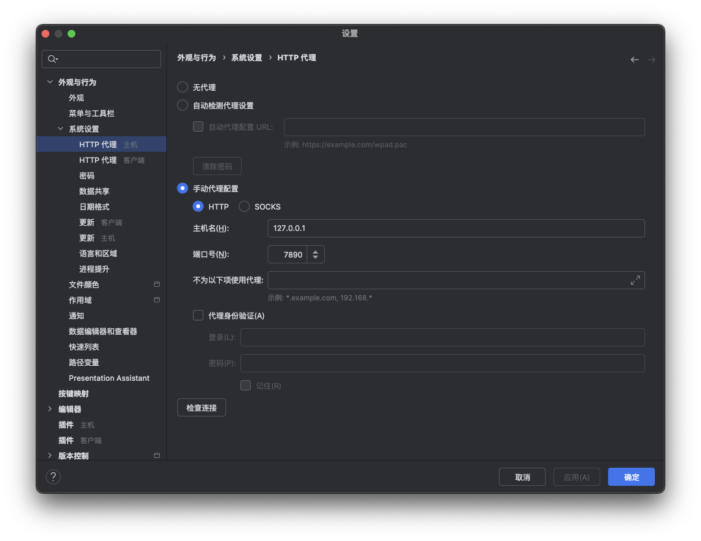
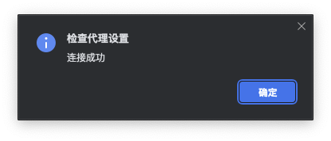

# clash-for-linux-install 配置记录

本文档为配置 clash-for-linux-install 的记录 [ [github] ](https://github.com/nelvko/clash-for-linux-install)

---

Canjia Huang <<canjia7@gmail.com>> last update 25/6/2025

# :penguin: Ubuntu

- 操作系统：Ubuntu 20.04.6 LTS

## 配置步骤

1. 将项目下载到本地：

    ```
    git clone --branch master --depth 1 https://gh-proxy.com/https://github.com/nelvko/clash-for-linux-install.git
    ```

    并进入项目目录：

    ```
    cd clash-for-linux-install
    ```

2. 设置安装 `clash` 内核（可选，这里不选，因为这样操作后后面应对无 root 权限的方法需要调整），参考 [FAQ 安装-clash-内核](https://github.com/nelvko/clash-for-linux-install/wiki/FAQ#安装-clash-内核)，执行：

    ```
    rm resources/zip/mihomo-linux-amd64-compatible-v1.19.2.gz
    ```

3. 如果没有 root 权限，参考 [issues #91](https://github.com/nelvko/clash-for-linux-install/issues/91)，执行：

    ```
    mkdir -p ~/.config/mihomo/
    ```
    ```
    cp resources/zip/mihomo-linux-amd64-compatible-v1.19.2.gz ~/
    ```
    ```
    cp resources/Country.mmdb ~/.config/mihomo/
    ```
    ```
    install -D -m +x <(gzip -dc ~/mihomo-linux-amd64-compatible-v1.19.2.gz) ~/bin/mihomo
    ```
    ```
    cat <<'EOF' >~/.config/mihomo/mihomo.sh
    ```
    ```
    mihomo() {
        case $1 in
        on)
            export http_proxy=http://127.0.0.1:7890
            export https_proxy=$http_proxy
            export HTTP_PROXY=$http_proxy
            export HTTPS_PROXY=$http_proxy
            export all_proxy=$http_proxy
            export ALL_PROXY=$http_proxy
            export NO_PROXY="localhost,127.0.0.1,::1"
            pgrep -f mihomo || {
                ~/bin/mihomo -d ~/.config/mihomo/ -f ~/.config/mihomo/config.yaml >& ~/.config/mihomo/log & 
            }
            echo '已开启代理环境'
            ;;
        off)
            unset http_proxy
            unset https_proxy
            unset HTTP_PROXY
            unset HTTPS_PROXY
            unset all_proxy
            unset ALL_PROXY
            unset no_proxy
            unset NO_PROXY
            pkill -9 -f mihomo
            echo '已关闭代理环境'
            ;;
        esac
    }
    EOF
    ```

    键入 `Control+D` 或 `Ctrl+D`，继续输入：

    ```
    echo >>~/.bashrc
    ```
    ```
    echo 'source ~/.config/mihomo/mihomo.sh' >>~/.bashrc
    ```
    ```
    echo 'mihomo on' >>~/.bashrc
    ```

4. 写入 yaml 配置文件：

    ```
    vim ~/.config/mihomo/config.yaml
    ```

    将通过其他订阅获取的 yaml 文件复制到该文件中，退出并保存

5. 重新加载环境变量：

    ```
    source ~/.bashrc
    ```

    此时已开启代理

# CLion 中使用代理

- CLion 版本：CLion 2024.3.4

## 配置步骤

1. 打开 “CLion - 设置”，选择 “外观与行为 - 系统设置 - HTTP 代理”（我这里是通过 CLion SSH 连接到 Linux 主机，即 clash-for-linux 的代理是在主机上配置的）

2. 在选项卡中设置 “手动配置代理”，“HTTP”，并设置主机号和端口，如下图：

    

3. 点击 “检查连接”，并输入 `https://google.com`，点击 “确定”，成功后会出现下图：

    