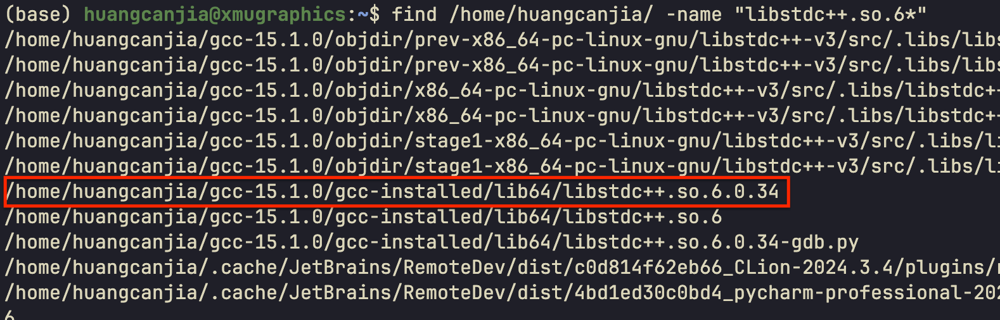
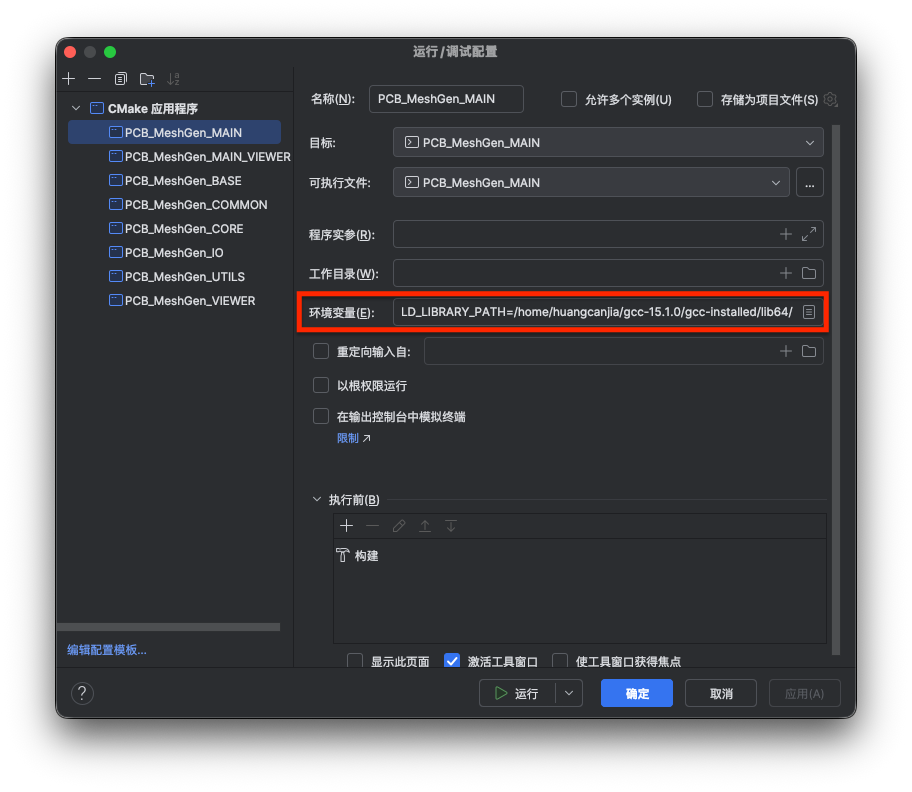

# gcc 配置记录

本文档为配置 g++/gcc 的过程记录文档

---

Canjia Huang <<canjia7@gmail.com>> update 20/6/2025

# :penguin: Ubuntu

- 操作系统：Ubuntu 20.04.6 LTS

## 配置步骤

参考 [ [1] ]

1. 在 [官网](http://ftp.gnu.org/gnu/gcc/) 下载所需版本的 gcc，我这里下载的版本是 “gcc-15.1.0”，即输入：

    ```
    wget https://ftp.gnu.org/gnu/gcc/gcc-15.1.0/gcc-15.1.0.tar.xz
    ```

2. 下载完毕后进行解压：

    ```
    tar -xvf gcc-15.1.0.tar.xz
    ```

    并进入解压得到的目录：

    ```
    cd gcc-15.1.0
    ```

3. 安装 gcc 的依赖库，执行：

    ```
    ./contrib/download_prerequisites
    ```

    :warning: 如果遇到网络问题无法下载，可以参考 [ [1] ] 中提出的方法

4. 新建安装 gcc 的目录（可以自行命名，但需要同步调整后续指令）：

    ```
    mkdir gcc-installed
    ```

5. 配置 gcc，执行：

    ```
    mkdir objdir
    cd objdir
    ../configure --disable-multilib --prefix=/home/huangcanjia/gcc-15.1.0/gcc-installed/
    ```

6. 编译 gcc，执行：

    ```
    make -j
    ```

    - :warning: 可能出现错误 `LIBRARY_PATH shouldn't contain the current directory when building gcc. Please change the environment variable`

        参考 [ [2] ]，暂时清空当前环境变量 `LIBRARY_PATH`，即在当前终端中输入：

        ```
        export LIBRARY_PATH=
        ```

        再重新进行编译
    
    - :warning: 可能出现错误 `g++: fatal error: unknown spec function ‘dumps’`

        参考 [ [3] ]，该问题可能是由于当前终端中的某些环境变量导致的，可以在一个更“干净”的环境中进行编译，即：

        ```
        env -i PATH=/bin:/usr/bin make -j
        ```
  
        <!-- 可能是因为编译该版本 gcc 所需的宿主 gcc 版本太低导致的（我这里的宿主 gcc 版本为 10.5.0），可以通过该文档前述步骤先配置一个稍微高一点版本的 gcc（我这里重新配置了版本为 12.1.0 的 gcc）作为宿主 gcc，再配置更高版本的 gcc -->

7. 安装 gcc，执行：

    ```
    make install
    ```

8. 将安装得到的目录添加到系统环境变量中：

    ```
    vim ~/.bashrc
    ```

    在文件的最后添加（具体路径根据实际情况而定）：

    ```
    export PATH=/home/huangcanjia/gcc-15.1.0/gcc-installed/bin/:$PATH
    export LD_LIBRARY_PATH=/home/huangcanjia/gcc-15.1.0/gcc-installed/lib/:$LD_LIBRARY_PATH
    export LD_LIBRARY_PATH=/home/huangcanjia/gcc-15.1.0/gcc-installed/lib64/:$LD_LIBRARY_PATH
    ```

    保存并退出后，重新载入系统环境变量：

    ```
    source ~/.bashrc
    ```

9. 最后进行测试，在终端中输入：

    ```
    gcc --version
    ```

    可以看到现在使用的是安装得到的 gcc

## 其他问题

- :warning: 如果在使用该 gcc 进行程序编译后，运行程序时出现错误 `/lib/x86_64-linux-gnu/libstdc++.so.6: version GLIBCXX_3.4.32 not found`

    解决方法参考 [ [4] ]

    首先查找编译结果中的 “libstdc++” 文件（具体查找路径根据实际情况而定）：

    ```
    find /home/huangcanjia/gcc-15.1.0/gcc-installed/ -name "libstdc++.so.6*"
    ```

    在查找结果中找到一个版本比较高的
    
    

    使用以下指令查看其是否包含所需的 GLIBCXX 版本：

    ```
    strings /home/huangcanjia/gcc-15.1.0/gcc-installed/lib64/libstdc++.so.6.0.34 | grep GLIBCXX
    ```

    应该会有需要的版本

    - 如果有 root 权限的话，接下来建立新的链接到该文件上，具体细节参考 [ [4] ]

    - 如果是在 IDE 中使用 SSH 连接而出现该错误的话
      - 一种解决方法是通过终端来执行编译好的可执行文件，而不是直接在 IDE 中运行
      - 另一种解决方法是在 IDE 中添加相应的系统环境变量，如在 CLion 中，在 ”运行/调试配置“ 中添加环境变量为上述定义的 `LD_LIBRARY_PATH` 路径

        


[1]: https://blog.csdn.net/Fhujinwu/article/details/113786909
[2]: https://blog.csdn.net/nianjiuhuiyi/article/details/126499209
[3]: https://superuser.com/questions/1161220/how-to-build-gcc-6-x-0-on-x64-without-unknown-spec-complain
[4]: https://blog.csdn.net/weixin_39379635/article/details/129159713