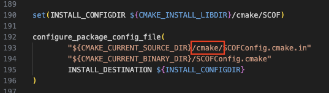
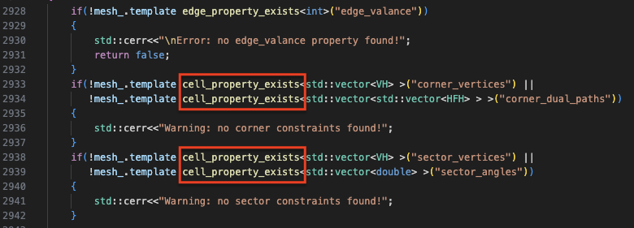

# libSCOF 配置记录

本文档为配置文章 “Singularity-constrained octahedral fields for hexahedral meshing” 的代码 [[doi]](https://dl.acm.org/doi/10.1145/3197517.3201344) [[code]](https://gitlab.vci.rwth-aachen.de:9000/SCOF/SingularityConstrainedOctahedralFields)

```
@article{10.1145/3197517.3201344,
    author = {Liu, Heng and Zhang, Paul and Chien, Edward and Solomon, Justin and Bommes, David},
    title = {Singularity-constrained octahedral fields for hexahedral meshing},
    year = {2018},
    issue_date = {August 2018},
    publisher = {Association for Computing Machinery},
    address = {New York, NY, USA},
    volume = {37},
    number = {4},
    issn = {0730-0301},
    url = {https://doi.org/10.1145/3197517.3201344},
    doi = {10.1145/3197517.3201344},
    journal = {ACM Trans. Graph.},
    month = jul,
    articleno = {93},
    numpages = {17},
    keywords = {singularity graph, octahedral fields, integer-grid maps, hexahedral meshing}
}
```

---

Canjia Huang <<canjia7@gmail.com>> last update 10/8/2025

# :penguin: Ubuntu

- 操作系统：Ubuntu 20.04.6 LTS

## 配置步骤

参考提供的 [BUILDING](https://gitlab.vci.rwth-aachen.de:9000/SCOF/SingularityConstrainedOctahedralFields/-/blob/master/BUILDING?ref_type=heads) 文件

1. 将项目下载到本地：

    ```
    git clone https://www.graphics.rwth-aachen.de:9000/SCOF/SingularityConstrainedOctahedralFields libSCOF
    ```

    并进入该项目目录：

    ```
    cd libSCOF
    ```

2. 新建存放编译结果的目录，并进入：

    ```
    mkdir build && cd build
    ```

3. 使用 CMake 进行 configure:

    ```
    cmake ..
    ```

    - :warning: 可能出现错误 `CMake Error: File /home/huangcanjia/libSCOF/CMAKE/SCOFConfig.cmake.in does not exist.`

        该问题是由于路径的大小写不一致导致的，可以修改 “libSCOF/CMakeLists.txt” 文件的 Line 193 的 “CMAKE” 为小写 “cmake”

        

4. 编译：

    ```
    make -j
    ```

    - :warning: 可能出现错误 `error: ‘SimplicialLDLT’ is not a member of ‘Eigen’`

        需要在文件 “libSCOF/src/SCOF/FrameFieldGeneratorT.cc” 中添加头文件 `#include <Eigen/SparseCholesky>`

    - :warning: 可能出现错误 `error: ‘using TetMesh = ...’ {aka ‘...’} has no member named ‘mesh_property_exists’; did you mean ‘cell_property_exists’?`

        需要将文件 “libSCOF/src/SCOF/MatchingsAndAlignmentExtractionT.cc” 的 Line 2933-2939 处的 `mesh_property_exists` 替换为 `cell_property_exists`

        

## 测试

编译成功后，会在 “libSCOF/build/Build/bin” 目录下生成可执行文件 **scof**，在 “build” 目录下执行：

```
./Build/bin/scof ../demo/scof/ellipsoid.ovm ../demo/scof/ellipsoid_output.ovm
```

运行成功后会在 “libSCOF/demo/scof” 目录下生成 “ellipsoid_output.ovm” 和 “ellipsoid_output.ofs” 文件